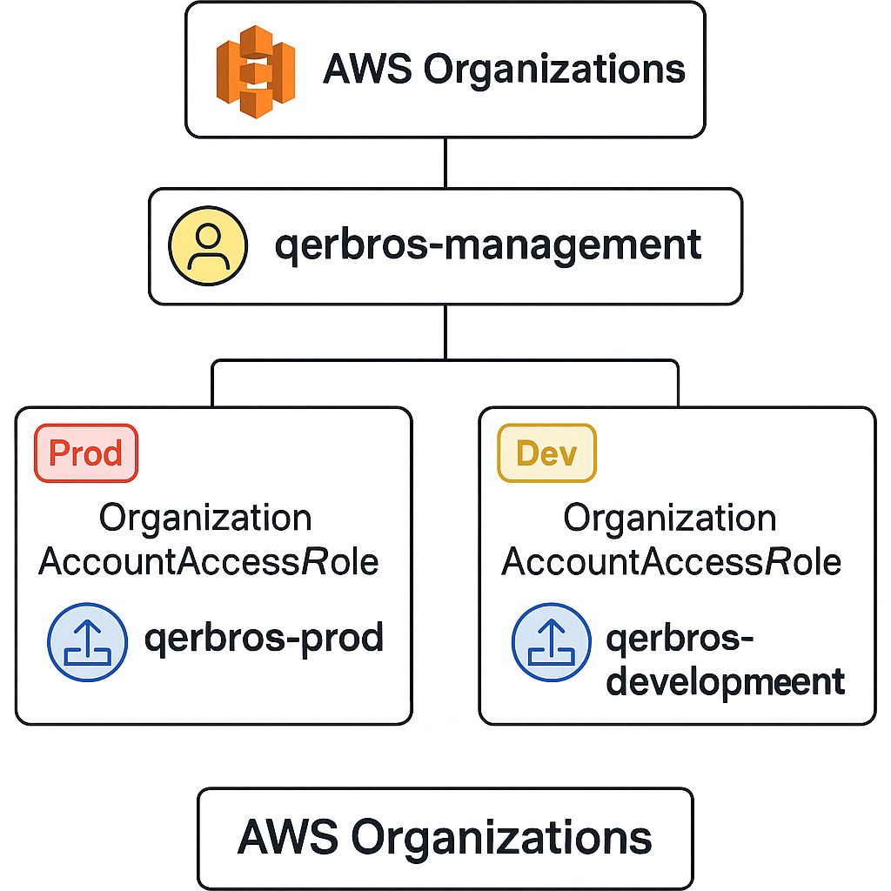

# AWS Organizations Multi-Account Setup — Hands-On Lab  

Thisdocument contains a practical hands-on guide for setting up an AWS Organization with multiple accounts:

- Management Account (`qerbros-management`)
- Production Account (`qerbros-prod`)
- Development Account (`qerbros-development`)

This structure follows AWS best practices for:
- Environment Isolation  
- Role Switching (Cross-Account Access)  
- Centralized Cloud Governance  

---

## Read Full Project Guide

---

## Diagram Preview  

  

---

## Author  

Noble W. Antwi  
Cloud & Security Enthusiast | AWS | DevOps  

[Connect on LinkedIn](https://www.linkedin.com/in/noble-antwi/)  
