 
 # AMAZON S3 DATA PROTECTION AND GLOBAL RESILIENCE

## Introduction

Welcome to my journey through the **Amazon S3 Data Protection and Global Resilience Workshop**! As someone deeply passionate about data security, I believe that our data is not just an asset; it's the heartbeat of our digital lives. The thought of losing or compromising it can be daunting, and that’s why I’m excited to dive into the protective measures available.

Amazon S3 stands out with its unmatched security, compliance, and auditing features, but there's always more we can do to elevate our data resilience. 

### What I’ll Explore

- **S3 Versioning**: This feature has been a real eye-opener for me. It's crucial for safeguarding against accidental deletions and is a stepping stone for using **S3 Object Lock**. Understanding how these work together is essential for keeping malicious threats at bay.

- **S3 Replication**: This is like a safety net for my data. It protects against disruptions, whether they come from account issues or regional outages. It empowers me to create globally resilient applications with **S3 Multi-Region Access Points**.

Throughout this workshop, I’ll be uncovering these insights and sharing my learnings.

### Modules I’ll Dive Into:

- S3 Versioning
- S3 Object Lock
- S3 Replication
- S3 Multi-Region Access Points
- Cross-account S3 Replication and Multi-Region Access Points


Here’s your content rephrased and formatted in markdown for clarity and a personal touch:


## Setting Up My S3 Buckets for the Workshop

In this workshop, I’m operating in the **US West (Oregon)** (us-west-2) region of the AWS Global Network. Most of my work will be done at the command line using **CloudShell** from the AWS Console, which is a fantastic tool that allows for seamless interactions with AWS services.
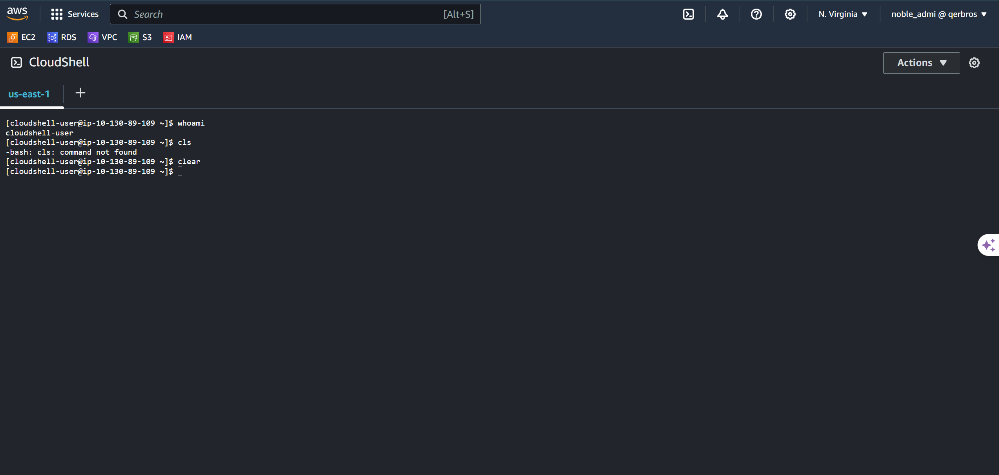
AWS has already created several S3 buckets for us to work with. However, to ensure that my buckets are unique to my personal account (since S3 bucket names must be globally unique), I need to generate a random suffix. Here’s how I did it:

### Generating Unique Bucket Names

To create unique bucket names, I run the following command to generate a random suffix and capture my AWS account ID:

```bash
bucket_suffix=$(aws sts get-caller-identity --query Account --output text | md5sum | awk '{print substr($1,length($1)-5)}')
account=$(aws sts get-caller-identity | jq -r '.Account')
```

#### Command Explanation

- `aws sts get-caller-identity --query Account --output text`: This retrieves my AWS account ID in a simple text format.
- `md5sum`: This command computes the MD5 hash of the account ID.
- `awk '{print substr($1,length($1)-5)}'`: This extracts the last five characters of the hash to use as a unique suffix.

After running the command, I confirm that my variables are set correctly by executing:

```bash
echo $bucket_suffix
echo $account
```

Here are the outputs I received:

```bash
[cloudshell-user@ip-10-130-89-224 ~]$ echo $bucket_suffix
3e3974
[cloudshell-user@ip-10-130-89-224 ~]$ echo $account
831285844664
```


### Creating My First S3 Bucket

Now that I have my unique suffix, I create my first S3 bucket for module 1 in the us-west-2 region using the following command:

```bash
aws s3api create-bucket --region us-west-2 --bucket dp-workshop-module-1-$bucket_suffix --create-bucket-configuration LocationConstraint=us-west-2
```

#### Command Explanation

- `aws s3api create-bucket`: This command creates a new S3 bucket.
- `--region us-west-2`: Specifies the region for the bucket.
- `--bucket dp-workshop-module-1-$bucket_suffix`: Sets the name of the bucket, incorporating the unique suffix.
- `--create-bucket-configuration LocationConstraint=us-west-2`: Indicates the specific region where the bucket is created.
- 

### Creating Additional S3 Buckets

Next, I need to create S3 buckets for modules 2 to 5. That was also achieved by running the command:

```bash
for buckets_in_uswest2 in {dp-workshop-module-2,dp-workshop-module-3-source-bucket,dp-workshop-module-3-report,dp-workshop-module-4-us-west-2,dp-workshop-module-5-primary-bucket}
do
    aws s3api create-bucket --region us-west-2 --bucket $buckets_in_uswest2-$bucket_suffix --create-bucket-configuration LocationConstraint=us-west-2
done

for buckets_in_useast1 in {dp-workshop-module-3-destination-bucket,dp-workshop-module-4-us-east-1,dp-workshop-module-5-secondary-bucket}
do
    aws s3api create-bucket --region us-east-1 --bucket $buckets_in_useast1-$bucket_suffix
done

aws s3api create-bucket --region ap-southeast-2 --bucket dp-workshop-module-4-ap-southeast-2-$bucket_suffix --create-bucket-configuration LocationConstraint=ap-southeast-2
```


#### Code Explanation

- The first loop creates several buckets in the **us-west-2** region. Each bucket name incorporates the unique suffix, ensuring that they are globally unique.
- The second loop creates buckets in the **us-east-1** region.
- The final command creates a bucket in the **ap-southeast-2** region, again using the unique suffix.

### Listing All My Buckets

After creating all the buckets, I use the following command to list them:

```bash
aws s3api list-buckets --query "Buckets[].Name" | jq -r '.[]|select(. | startswith("dp-workshop-module-"))'
```

This command returns a list of my newly created buckets:

```json
dp-workshop-module-1-3e3974
dp-workshop-module-2-3e3974
dp-workshop-module-3-destination-bucket-3e3974
dp-workshop-module-3-report-3e3974
dp-workshop-module-3-source-bucket-3e3974
dp-workshop-module-4-ap-southeast-2-3e3974
dp-workshop-module-4-us-east-1-3e3974
dp-workshop-module-4-us-west-2-3e3974
dp-workshop-module-5-primary-bucket-3e3974
dp-workshop-module-5-secondary-bucket-3e3974
```
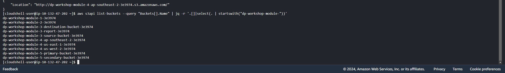
Additionally, I have a GUI snapshot of the buckets for a visual representation.
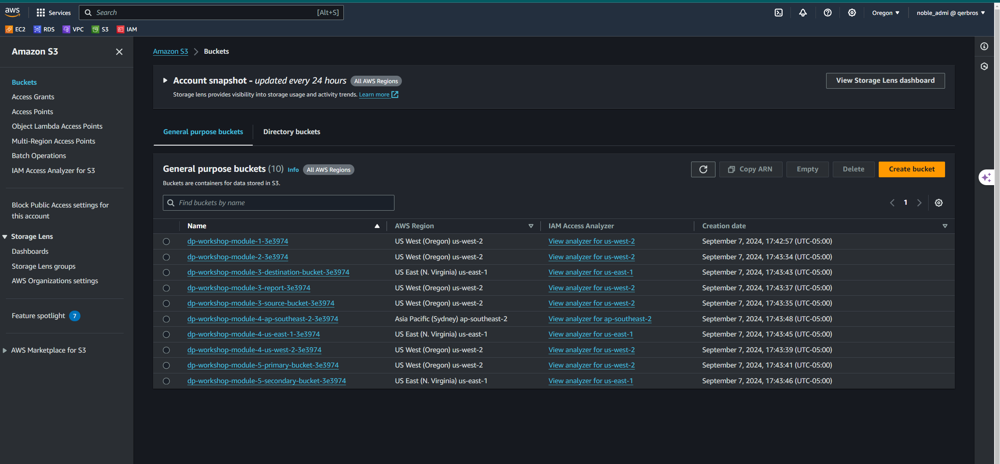


Here’s your content rephrased and formatted in markdown, with explanations for S3 Multi-Region Access Points and the commands used:

### Creating an S3 Multi-Region Access Point for Module 4

In this final step, I created an **S3 Multi-Region Access Point** for module 4. But first, what exactly is an S3 Multi-Region Access Point, and why is it important?

#### What is an S3 Multi-Region Access Point?

An **S3 Multi-Region Access Point** simplifies data access across multiple AWS regions. It allows you to manage and access data in different S3 buckets from a single endpoint. This is particularly useful for applications that require low-latency access to data stored in different geographic locations. With Multi-Region Access Points, I can:

- **Improve Availability**: By distributing my data across regions, I can enhance redundancy and resilience.
- **Reduce Latency**: Users can access data from the nearest region, resulting in faster response times.
- **Simplify Management**: I can manage multiple buckets from a single access point, streamlining my operations.

### Creating the Multi-Region Access Point

To create the Multi-Region Access Point, I ran the following command, capturing the creation request token as an environment variable:

```bash
mrapcreationrequestarn=$(aws s3control create-multi-region-access-point --region us-west-2 --account-id $account \
--details Name=mrap-1,Regions=[{Bucket=dp-workshop-module-4-us-east-1-$bucket_suffix},{Bucket=dp-workshop-module-4-us-west-2-$bucket_suffix},{Bucket=dp-workshop-module-4-ap-southeast-2-$bucket_suffix}] \
| jq -r '.RequestTokenARN')
```

#### Command Explanation

- `aws s3control create-multi-region-access-point`: This command initiates the creation of a Multi-Region Access Point.
- `--region us-west-2`: Specifies the region in which the request is being made.
- `--account-id $account`: Passes my AWS account ID to authorize the operation.
- `--details`: This flag is used to specify the details of the Multi-Region Access Point:
  - `Name=mrap-1`: Sets the name of the access point.
  - `Regions=[]`: Defines the buckets to be included in the access point. Each bucket name is combined with the unique suffix to ensure global uniqueness.
- The output is piped through `jq -r '.RequestTokenARN'` to extract the request token ARN, which is stored in the variable `mrapcreationrequestarn`.

### Querying the Creation Process

To check the status of my Multi-Region Access Point creation, I used the following command:

```bash
aws s3control --region us-west-2 describe-multi-region-access-point-operation --account $account --request-token-arn $mrapcreationrequestarn
```

This command returned the following output:

```json
{
    "AsyncOperation": {
        "CreationTime": "2024-09-22T20:49:28.968000+00:00",
        "Operation": "CreateMultiRegionAccessPoint",
        "RequestTokenARN": "arn:aws:s3:us-west-2:831285844664:async-request/mrap/create/TTFYWa3pckRXc5905vmgCyvw7nbsHgBaMlkwU1RLV9D9oIgzkGlR69D4UYGiJ_qEdVCyxy_Lp5XqbhXw9l1GUTRZUjc0OA",
        "RequestParameters": {
            "CreateMultiRegionAccessPointRequest": {
                "Name": "mrap-1",
                "PublicAccessBlock": {
                    "BlockPublicAcls": true,
                    "IgnorePublicAcls": true,
                    "BlockPublicPolicy": true,
                    "RestrictPublicBuckets": true
                },
                "Regions": [
                    {
                        "Bucket": "dp-workshop-module-4-us-east-1-3e3974"
                    },
                    {
                        "Bucket": "dp-workshop-module-4-us-west-2-3e3974"
                    },
                    {
                        "Bucket": "dp-workshop-module-4-ap-southeast-2-3e3974"
                    }
                ]
            }
        },
        "RequestStatus": "INPROGRESS"
    }
}
```

#### Output Explanation

- **CreationTime**: This indicates when the creation process began.
- **Operation**: Confirms that the operation is for creating a Multi-Region Access Point.
- **RequestTokenARN**: This unique identifier helps track the specific creation request.
- **RequestParameters**: Details about the request, including the access point name and the buckets involved.
- **RequestStatus**: Currently shows as **INPROGRESS**, which means the process is ongoing. Once completed, this status will change to **COMPLETED**.

With this Multi-Region Access Point in place, I can look forward to more efficient and resilient data management across regions!
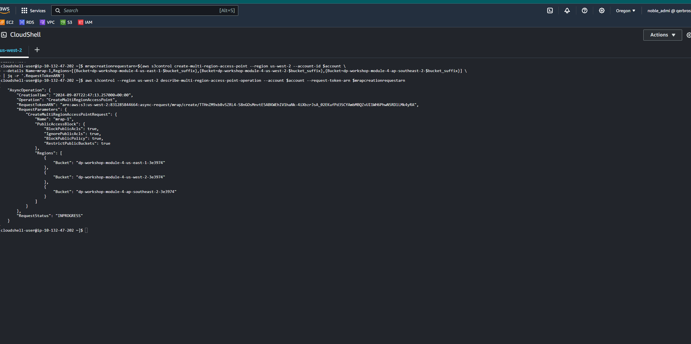

---


## Module 1: S3 Versioning

In this module, I dove into the world of **S3 Versioning**, a powerful feature in Amazon S3 that allows us to keep multiple versions of an object within the same bucket. This capability is a game changer when it comes to data management, enabling me to preserve, retrieve, and restore every version of my objects seamlessly.

With versioning enabled, I found that recovering from unintended user actions or application failures becomes much simpler. For instance, if I accidentally delete or overwrite a file, S3 doesn’t just wipe it out. Instead, it inserts a **delete marker**, making it the current version while keeping the original safe and sound. This means that every time I upload a file, if multiple write requests come in at once, S3 keeps all those versions, allowing me to go back in time whenever I need to.

This module will guide you through:
- Enabling versioning for your bucket.
- Understanding how objects behave when deleted.
- Restoring deleted objects and permanently removing them from a versioned bucket.


### Configuring S3 Versioning for Module 1

As part of **Module 1**, I began by working with my first S3 bucket. This bucket didn’t yet have versioning enabled, so I started with the basics before diving into version control.

#### Assigning a Bash Variable to the Module-1 Bucket

To make working with this bucket easier, I needed to assign a bash variable to it. This step allows me to reference the bucket easily in future commands without having to type out its full name each time.

In my AWS CloudShell session, I ran the following command to pull the bucket name:

```bash
module1_bucket=$(aws s3api list-buckets --query "Buckets[].Name" | jq -r '.[]|select(. | startswith("dp-workshop-module-1"))')
```

I then verified that the command had correctly assigned the bucket name:

```bash
echo $module1_bucket
```

The output confirmed success:

```bash
dp-workshop-module-1-3e3974
```
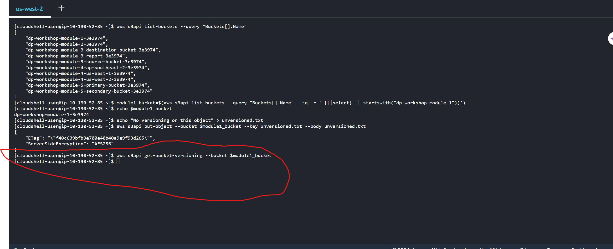


### Uploading an Object Without Versioning

With the bucket ready, I moved on to writing an object into it. This was important because I needed to see how objects behave in a non-versioned bucket.

I created a simple text file using this command:

```bash
echo "No versioning on this object" > unversioned.txt
```

Then I uploaded the file into my S3 bucket:

```bash
aws s3api put-object --bucket $module1_bucket --key unversioned.txt --body unversioned.txt
```
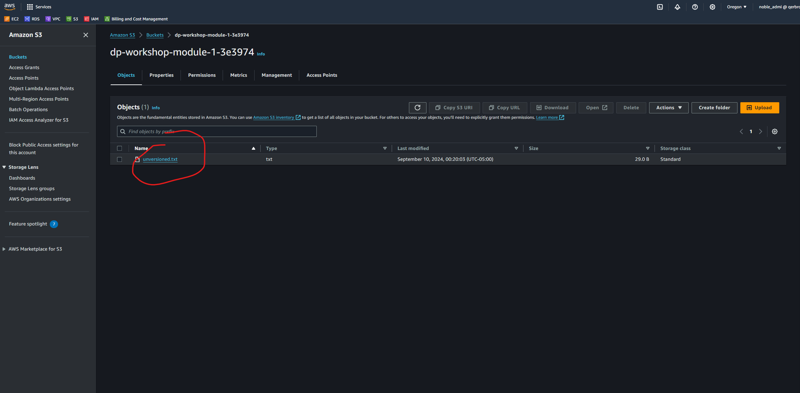
At this point, the bucket didn’t have versioning enabled. I ran the following command to confirm:

```bash
aws s3api get-bucket-versioning --bucket $module1_bucket
```

Since the output didn’t return anything, I knew versioning wasn’t active yet.
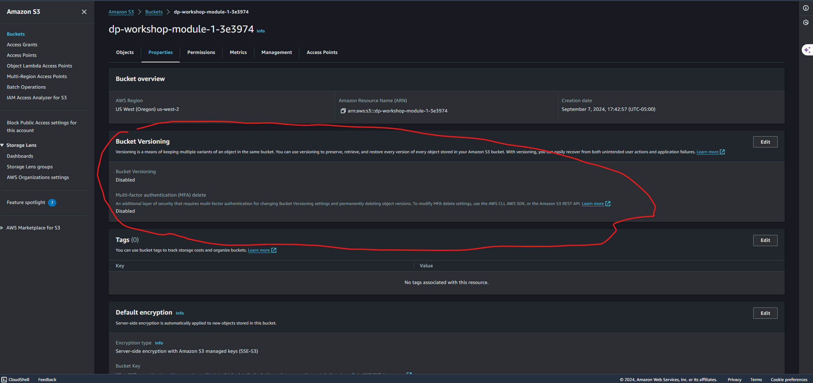

#### Checking the Uploaded Object

Next, I checked the list of objects in the bucket with:

```bash
aws s3api list-objects-v2 --bucket $module1_bucket
```

Interestingly, each object in Amazon S3 has a **Version ID** whether or not S3 Versioning is enabled. I verified this by running:

```bash
aws s3api list-object-versions --bucket $module1_bucket
```

Since the bucket wasn’t versioned at this point, Amazon S3 set the **Version ID** for the object to `null`, confirming that no versioning had been applied yet.

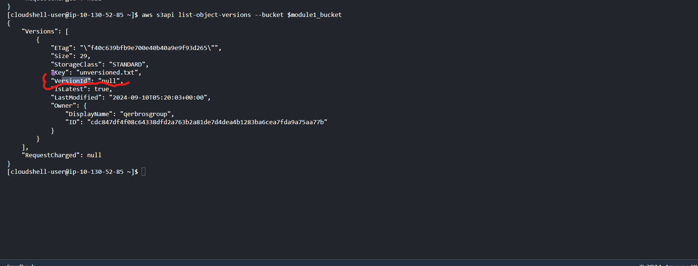

#### Enabling S3 Versioning

Now it was time to enable versioning on the bucket. Versioning is critical when it comes to protecting data from accidental deletions or overwrites. I did this by running the following command:

```bash
aws s3api put-bucket-versioning --bucket $module1_bucket --versioning-configuration Status=Enabled
```

It's important to note that once a bucket is version-enabled, it can never return to an un-versioned state. You can only **suspend** versioning, but never completely disable it.
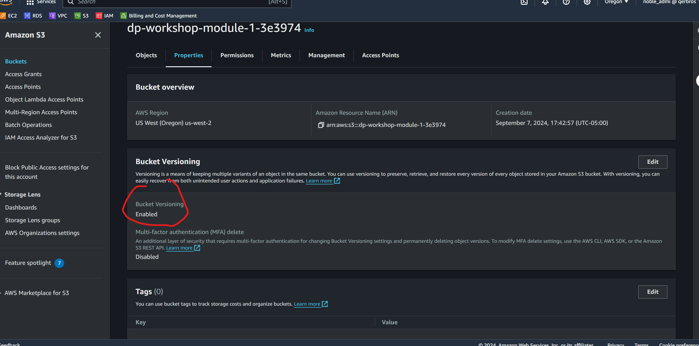

#### Verifying Versioning

To confirm that versioning was successfully enabled, I checked the versioning status again with:

```bash
aws s3api get-bucket-versioning --bucket $module1_bucket
```

Additionally, I confirmed the configuration on the **S3 Console** under the **Properties** section of the bucket.

### Key Takeaway

Once versioning is enabled, any objects already stored in the bucket retain their original `VersionId` of `null`. This means that even older objects can be managed with versioning going forward. It's a simple but powerful tool that brings extra resilience to my S3 data.
---


### Uploading, Overwriting, and Deleting Objects in Module 1

Now that I've enabled versioning on my **Module 1** bucket, it was time to get hands-on with one of the most practical aspects of S3 versioning—managing file versions and understanding the effect of deletions.

#### Creating and Uploading the First Version of "important.txt"

First, I created a file named **important.txt** in my CloudShell environment. This file would represent a critical piece of data, and I wanted to explore how versioning protects it from accidental overwrites and deletions. Here’s the command I used to create it:

```bash
echo "Version 1" > important.txt
```

With the file created, I uploaded it to my version-enabled bucket using the following command:

```bash
aws s3api put-object --bucket $module1_bucket --key important.txt --body important.txt
```
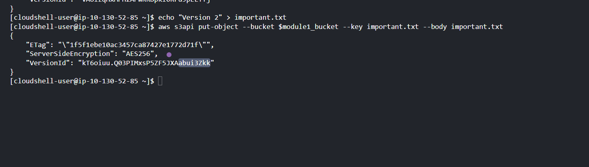
### Overwriting an Object in S3

Next, I edited the **important.txt** file by changing its content to represent a new version. This simulates a scenario where a file gets updated over time. I updated the file by running:

```bash
echo "Version 2" > important.txt
```

To overwrite the existing file in S3, I used the same **put-object** command to upload the new version:

```bash
aws s3api put-object --bucket $module1_bucket --key important.txt --body important.txt
```

Immediately, S3 generated a new **Version ID** for this updated file, ensuring that the previous version remains safe. The response confirmed this with the new **Version ID**:


This is a key benefit of S3 versioning—it keeps every version of a file, so even if something gets overwritten, the older versions are preserved.

#### Verifying the Latest Version

To verify that only the latest version of the object was visible in the bucket, I ran:

```bash
aws s3api list-objects-v2 --bucket $module1_bucket
```
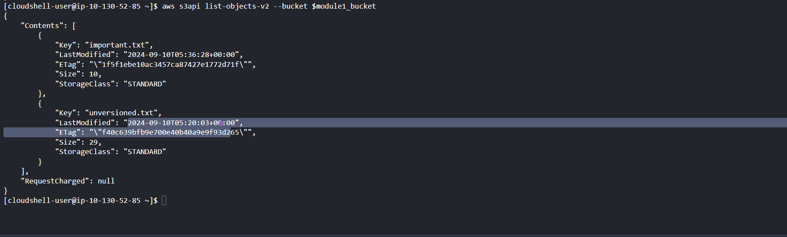

As expected, only the latest version of **important.txt** (Version 2) was displayed. I confirmed this by downloading the file using:

```bash
aws s3api get-object --bucket $module1_bucket --key important.txt testfile.txt
```
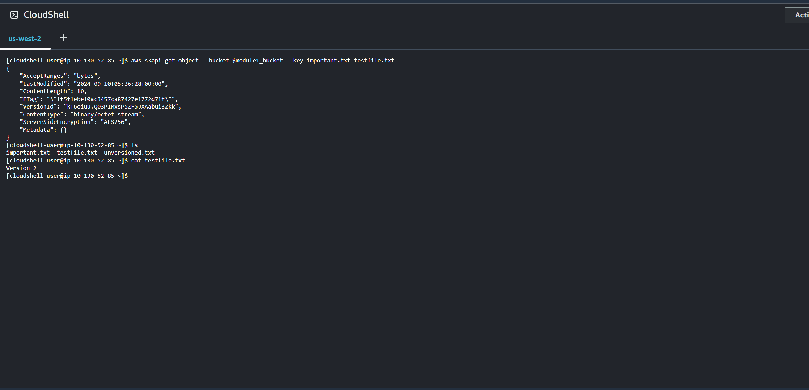

I displayed the file’s contents with:

```bash
cat testfile.txt
```

The output showed `"Version 2"`, just as I had updated it.


#### Listing All Versions of an Object

One of the most exciting features of S3 versioning is that all previous versions of an object are preserved. To see every version of **important.txt** stored in the bucket, I ran:

```bash
aws s3api list-object-versions --bucket $module1_bucket
```

This command revealed both the first version (Version 1) and the updated one (Version 2), each with its respective **Version ID**.
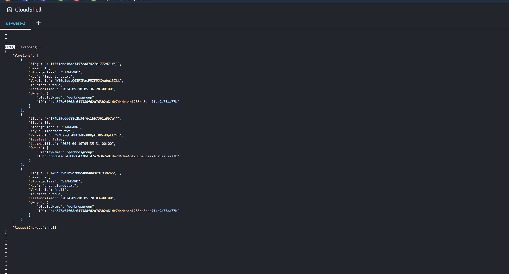

In the AWS Console, I also enabled the **Show versions** toggle within the **Objects** tab of the bucket to visually confirm the version history, which included the creation date and other properties for each version.
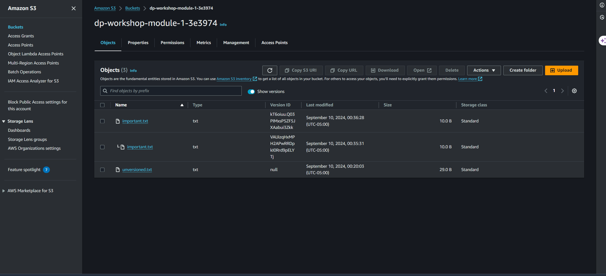

#### Deleting an Object

Now, I tested how S3 handles deletions when versioning is enabled. I deleted **important.txt** using the following command:

```bash
aws s3api delete-object --bucket $module1_bucket --key important.txt
```

Rather than permanently removing the object, S3 created a **delete marker**. The response confirmed this:

```json
{
    "DeleteMarker": true,
    "VersionId": "YWdz.7gpmFqQ2lq_PC2VmiRHddq1lOVE"
}
```

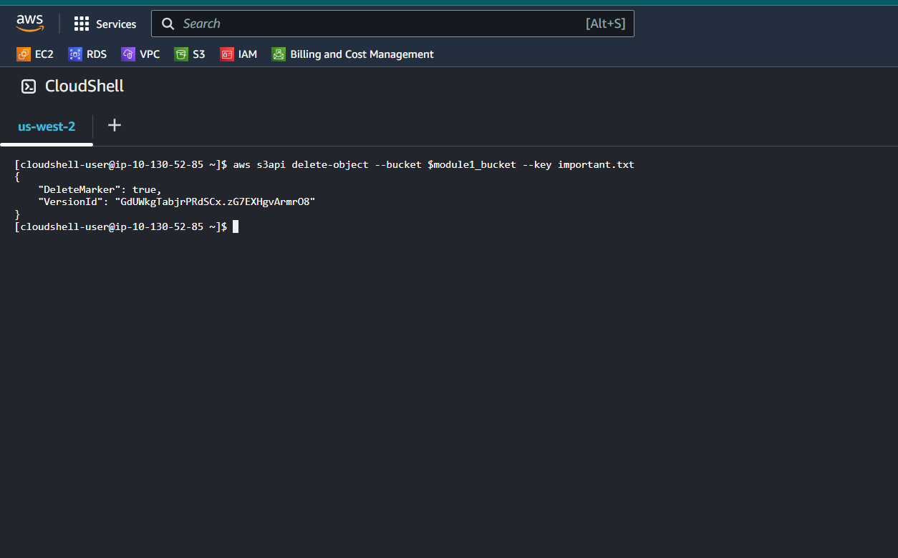

When versioning is enabled, a deletion doesn't actually remove the object—it simply marks it as "deleted," and the delete marker becomes the latest version of the object. To see this in action, I ran:

```bash
aws s3api list-objects-v2 --bucket $module1_bucket
```
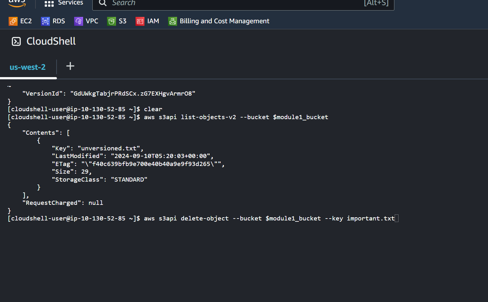

Since the delete marker was masking the object, **important.txt** no longer appeared in the list of visible objects.

However, by listing all versions of objects in the bucket, I could still see both the previous versions of **important.txt** and the delete marker:

```bash
aws s3api list-object-versions --bucket $module1_bucket
```
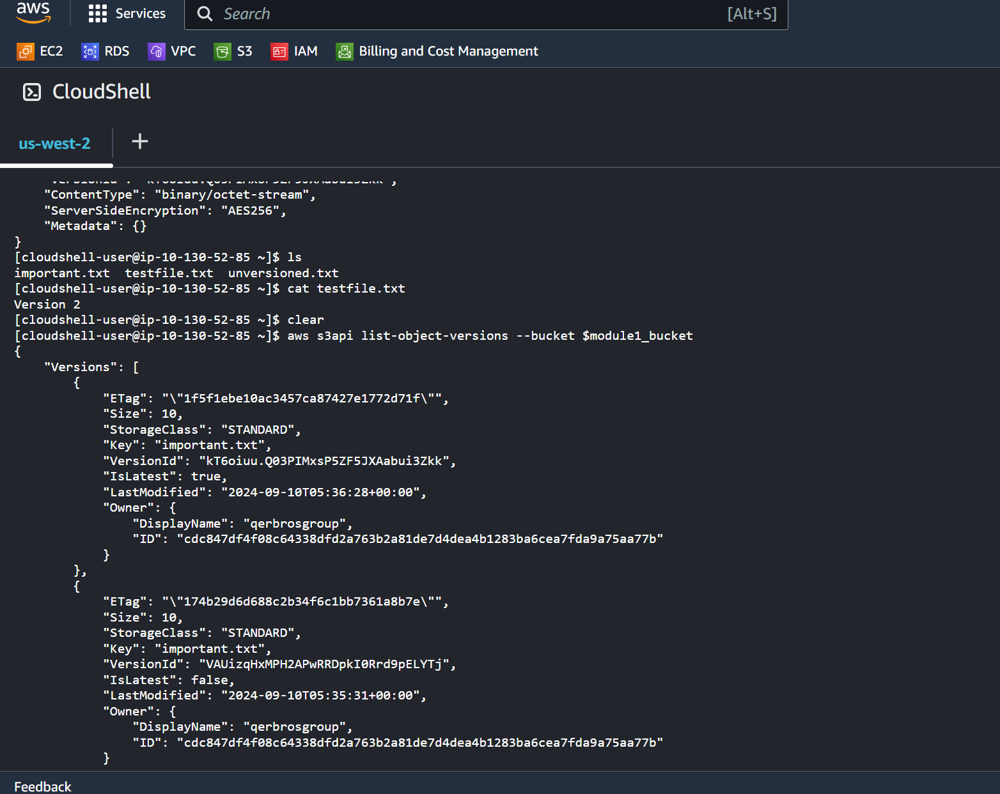

#### Key Takeaway

In S3 with versioning enabled, a file’s history is always preserved, no matter how many times it is overwritten or deleted. Even after I deleted **important.txt**, I could still access its earlier versions by referencing their **Version ID**. This provides a powerful safety net for ensuring the integrity and availability of data, especially in scenarios where files might be accidentally or maliciously deleted.


### Restoring a Deleted Object

During my testing, I realized that deleting an object in an S3 bucket with versioning enabled doesn’t actually remove the object—it just hides it with a delete marker. To bring the object back, I needed to restore it by removing this delete marker. This process essentially promotes the most recent version of the file to become the current version again.

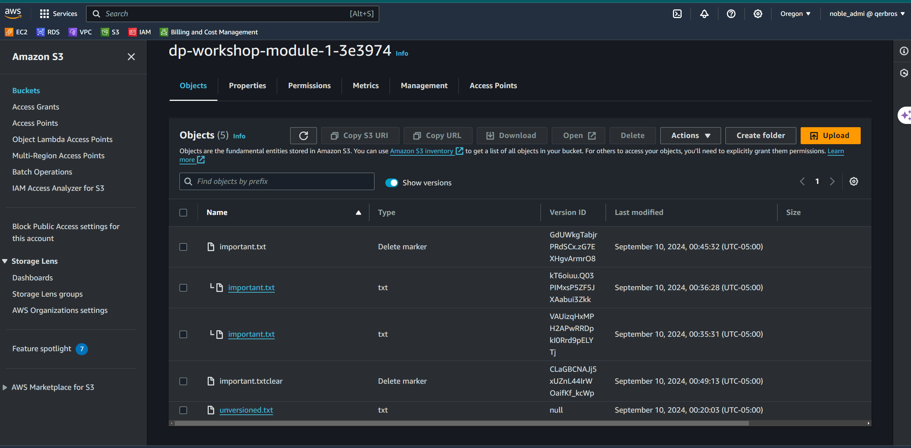
To do this, I performed a **version-specific delete** on the delete marker, using its **Version ID** (which I noted earlier). Here’s the command I ran to permanently delete the delete marker:

```bash
aws s3api delete-object --bucket $module1_bucket --key important.txt --version-id "Version ID of delete marker"
```
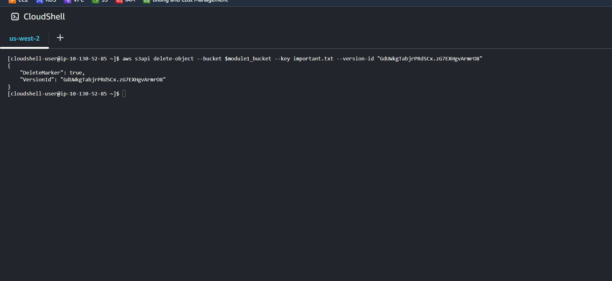
Once I executed this command, the delete marker was removed, and **important.txt** reappeared as the current version. I confirmed this by listing the objects in the bucket:

```bash
aws s3api list-objects-v2 --bucket $module1_bucket
```
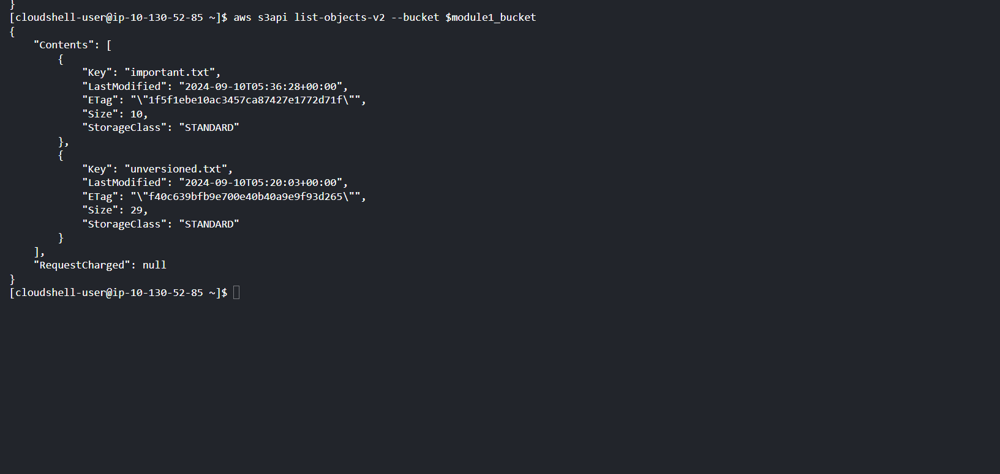
Just like that, the file was back in place, confirming that S3 versioning can effectively protect my data even after it’s been "deleted."
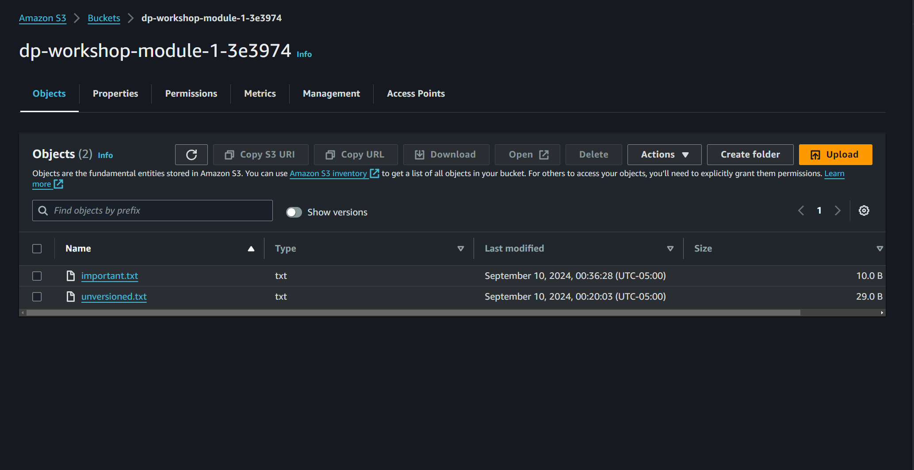

###  Deleting a Specific Object Version

Next, I experimented with permanently deleting a specific version of an object. Unlike the previous delete process, this wouldn’t leave a delete marker—it would completely remove that version from the bucket.

To start, I found the **Version ID** of the current version of **important.txt** by running the following command:

```bash
aws s3api list-object-versions --bucket $module1_bucket
```

I identified the version of the file where `"IsLatest": true`, meaning it was the current version, and ran the **delete-object** command, specifying the **Version ID** of the version I wanted to delete:

```bash
aws s3api delete-object --bucket $module1_bucket --key important.txt --version-id "Version ID of current version"
```
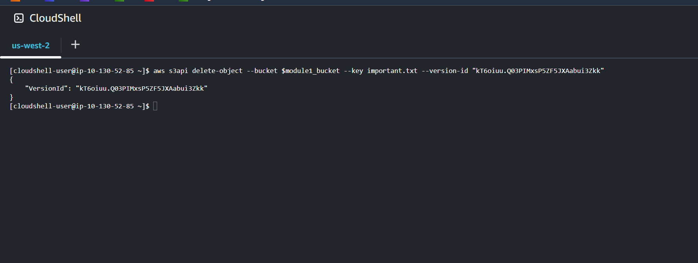

After running this, the specific version was permanently removed from the bucket. I could verify this by running the following command to list all object versions again:

```bash
aws s3api list-object-versions --bucket $module1_bucket
```

Even though I had deleted one version, the other versions of **important.txt** remained safely stored. The versioning system kept track of all changes, allowing me to restore older versions when needed.

### Verifying the Changes

I downloaded the **important.txt** object again, just to check which version had been promoted to the current one:

```bash
aws s3api get-object --bucket $module1_bucket --key important.txt testfile_2.txt
```

And then I displayed the file’s contents:

```bash
cat testfile_2.txt
```

The output confirmed that **Version 1** had been restored as the current version, since I had deleted **Version 2**.
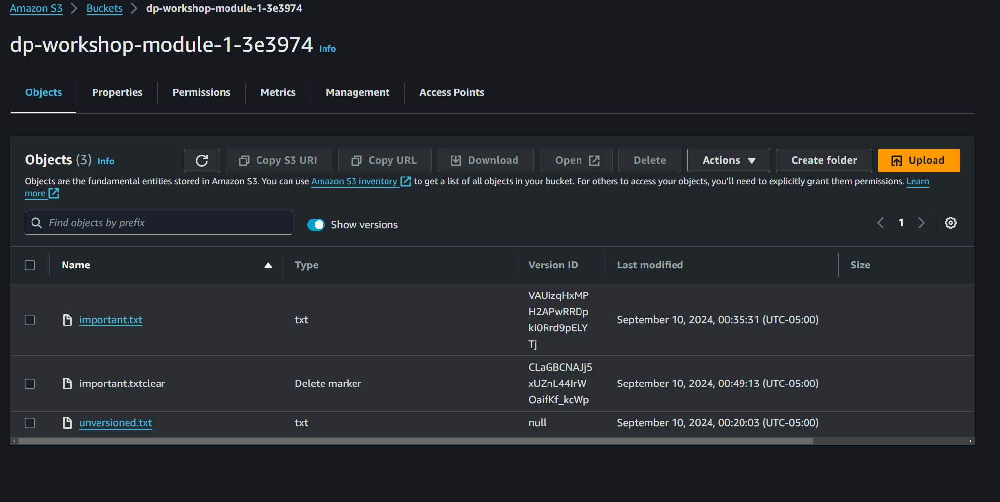

#### Reflecting on S3 Versioning

At this point, I had successfully learned how to use S3 versioning to not only upload and overwrite objects but also restore deleted objects and manage specific versions. It was eye-opening to see how versioning ensures data integrity, even in scenarios where files are accidentally or deliberately deleted.

### Considerations for the Future

While versioning is incredibly useful, keeping all versions of objects can lead to increased storage costs. It’s essential to think about lifecycle management when using S3 versioning. For instance, I can set up **lifecycle rules** to automatically archive or delete old versions after a set period of time. This way, I’ll lower my storage costs without losing the ability to roll back to a previous version if something goes wrong.

One cool approach would be to move older versions of objects to **Amazon S3 Glacier** (Instant Retrieval or Flexible Retrieval) for cheaper storage, and then automatically delete them after a specific number of days. This gives a balance between keeping backups and controlling costs.

And with that, I completed the hands-on exploration of S3 Versioning. It’s such a vital tool for managing data with confidence, especially in environments where data changes frequently.


 
 ===========================================================================
 ### Creating Life Cycle Rules for Managing Objects in S3


 ``` json
echo '{
    "Version": "2012-10-17",
    "Statement": [
        {
            "Sid": "Deny delete-object-version",
            "Effect": "Deny",
            "Principal": {
                "AWS": "*"
            },
            "Action": "s3:DeleteObjectVersion",
            "Resource": "arn:aws:s3:::'$module1_bucket'/*"
        }
    ]
}' > deny-deleteobjectversion-policy.json

 ```


 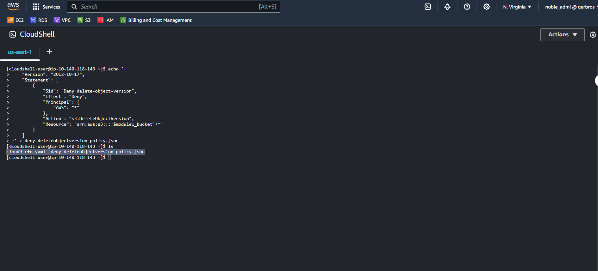

 ### Attached the Polcy to the backet
 The newly created policy was then attached to the bucket *$module1_bucket* which has its actual bucket name as *dp-workshop-module-1-3e3974* as can be seen in the image below which can be found under the permissions tab when the bucket name is clicked on
 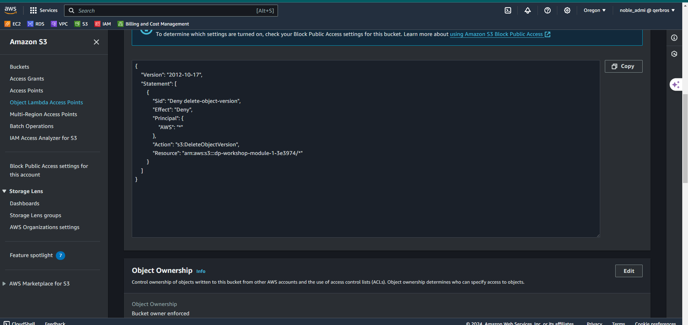

 I then created a new object in the bucket making use of the command
 ```bash
 aws s3api put-object --bucket $module1_bucket --key important-version.txt --body important.txt
 ```
 ### Uploading Files to S3 with AWS CLI

In this step, I used the AWS CLI to upload an important file to my S3 bucket, ensuring it’s stored with a versioned key.

To do this, I used the following command:

```bash
aws s3api put-object --bucket $module1_bucket --key important-version.txt --body important.txt
```
#### What’s Happening Here?

- **Bucket**: Instead of hardcoding the bucket name, I’m using an environment variable `$module1_bucket`, which makes things dynamic and flexible. This variable stores the actual name of my S3 bucket, keeping my setup adaptable to different environments.

- **Key**: The file I’m uploading will be stored under the name `important-version.txt`. Even though the local file is called `important.txt`, I can give it a different name (or key) in S3. This allows me to manage different versions or iterations without overwriting the original files.

- **Body**: The local file `important.txt` is what I’m uploading. It’s a simple text file that I want to store in S3, but S3 allows me to store much more complex data if needed.

By running this command, I was able to securely upload my file to Amazon S3 and easily manage it within the bucket.
