# THREE TIER ARCHITECTURE IMPLEMENTATION ON AWS

The three-tier architecture is a widely adopted software design pattern that divides applications into three distinct layers: the presentation layer, the business logic layer, and the data storage layer. This segmentation facilitates better organization and scalability, particularly in client-server environments like web applications. Each tier performs specific functions and can be managed independently, contrasting with the older monolithic approach where all components were integrated into a single entity.

When it comes to implementing such architectures in the cloud, Amazon Web Services (AWS) stands out as a leading provider offering a plethora of cloud computing services. Some key AWS services essential for building a robust three-tier cloud infrastructure include Elastic Compute Cloud (EC2), Auto Scaling Group, Virtual Private Cloud (VPC), Elastic Load Balancer (ELB), Security Groups, and the Internet Gateway. By leveraging these services, developers can design systems that are highly available and fault-tolerant, ensuring uninterrupted performance even in the face of failures.

In practical terms, utilizing AWS services enables developers to deploy scalable virtual servers (EC2) that automatically adjust to fluctuating demands (Auto Scaling Group). They can also create isolated network environments (VPC) with controlled access and traffic routing (Security Groups, Internet Gateway) while distributing incoming traffic across multiple instances for better performance and reliability (ELB). This approach reflects a paradigm shift towards more resilient and adaptable cloud-based architectures, aligning with modern application development practices.

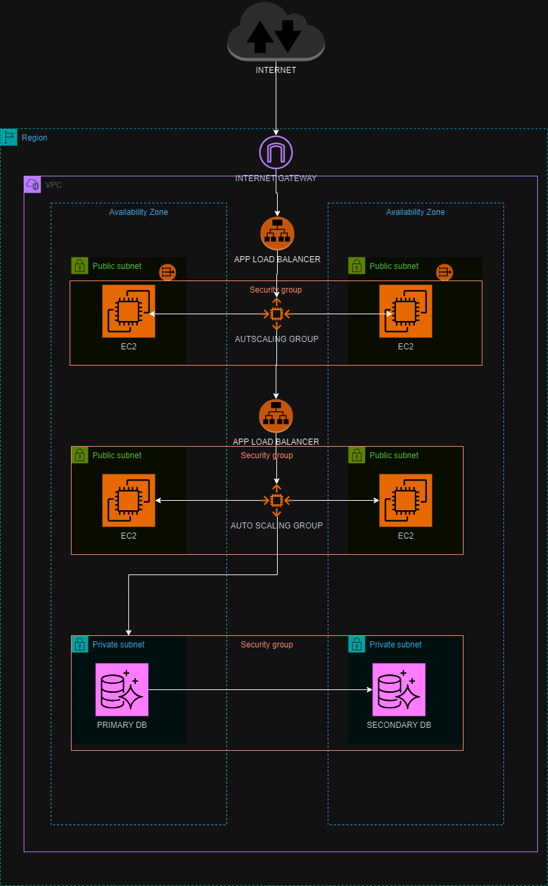

Architectrual Diagram can be found at 
https://drive.google.com/file/d/12wnWdic_07iAOk1HJWzQ00iMLe-AVaQk/view?usp=sharing

Our goal is to address several key aspects in designing our application infrastructure:

1. Scalability: Each tier of our architecture should be capable of scaling horizontally to accommodate varying levels of traffic and requests. This can be achieved by dynamically adjusting the number of EC2 instances in each tier and load balancing across them. For example, we can add more instances to handle increased demand and scale down during periods of lower traffic automatically.
2. Fault Tolerance: We design our infrastructure to withstand unexpected changes in traffic and faults. This involves implementing redundancy measures, such as maintaining extra EC2 instances to handle increased load without compromising performance. By distributing the workload across multiple instances, we mitigate the impact of failures and ensure uninterrupted service.
3. Security: Our infrastructure prioritizes security by minimizing exposure to external threats. We establish private communication channels within the application, using private IPs and subnet configurations. The presentation tier remains isolated in a private subnet accessible only through an application load balancer, while backend and database tiers are similarly protected from internet access. Additionally, we implement security measures like Bastion hosts for remote SSH access and NAT gateways for internet connectivity within private subnets. AWS security groups further enhance our defenses by restricting access to authorized entities only.
4. High Availability: Unlike traditional data centers that are susceptible to regional disasters, we leverage AWS's multiple availability zones to ensure high availability. By distributing our application across different geographical locations, we minimize the risk of downtime due to localized events like earthquakes or power outages
5. Modularity: We aim to break down our application into separate, manageable components, allowing teams to focus on specific tiers independently. This modular approach ensures agility in making changes and enables quick recovery from unexpected issues by isolating and addressing faulty parts.
In summary, our approach focuses on achieving a well-structured, scalable, highly available, fault-tolerant, and secure infrastructure tailored to meet the demands of modern application environments.

Now that we have gotten introduced to the task at hand, we proceed to execute it.
NB: Original Project Source as an AWS Project that can be found using the link [Click to View the Original Project](https://catalog.us-east-1.prod.Projects.aws/Projects/85cd2bb2-7f79-4e96-bdee-8078e469752a/en-US/introduction)


## PART 0: : PROJECT SETUP

To begin this Project, I first downloaded the code from GitHub and uploaded it to an S3 bucket so my instances could access it. Additionally, I created an AWS Identity and Access Management (IAM) EC2 role to enable secure connections to my instances using AWS Systems Manager Session Manager, eliminating the need for SSH key pairs
This was started by cloning the orinal project from AWS on Github in order to access the project file as can be seen below:
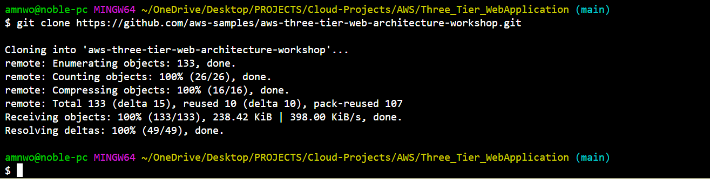

The code for the clone is
```
git clone https://github.com/aws-samples/aws-three-tier-web-architecture-Project.git

```

### Creating S3 Bucket
I created a buket by name **three-tier-web-application-bucket** which will serve as a place holder for all the application codes and other important file. In the creation process, all the default were maintained in order to achieve maximum security. The bucket was created in the US East (N. Virginia) us-east-1 region.


### IAM EC2 Instance Role Creation
To set up the necessary permissions for my EC2 instances, I navigated to the IAM dashboard in the AWS console and created a new EC2 role. I selected EC2 as the trusted entity.

While adding permissions, I included the following AWS managed policies to ensure my instances could download code from S3 and use Systems Manager Session Manager for secure connections without needing SSH keys:

1. AmazonSSMManagedInstanceCore
2. AmazonS3ReadOnlyAccess
   
I named this role three-tier-webapp-EC2-SSM-S3 to reflect its purpose and scope.

The tust relationship created is
```
{
    "Version": "2012-10-17",
    "Statement": [
        {
            "Effect": "Allow",
            "Principal": {
                "Service": "ec2.amazonaws.com"
            },
            "Action": "sts:AssumeRole"
        }
    ]
}
```
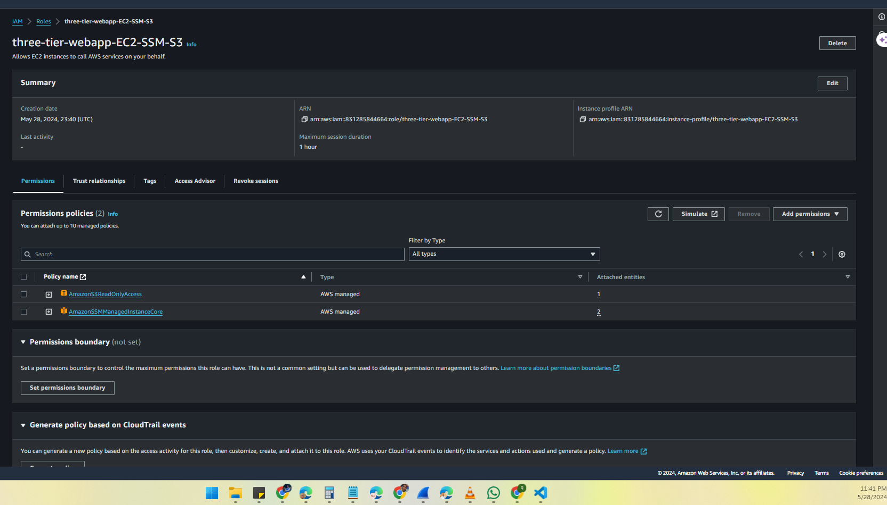


## PART 1: NETWORKING AND SECURITY

In this section, I focused on building out the VPC networking components and security groups to add a layer of protection around my EC2 instances, Aurora databases, and Elastic Load Balancers.

### Virtual Private Cloud (VPC)

A Virtual Private Cloud (VPC) is a logically isolated section of the AWS cloud where you can launch AWS resources in a virtual network that you define. It provides complete control over your virtual networking environment, including the selection of your own IP address range, the creation of subnets, and the configuration of route tables and network gateways. Essentially, a VPC enables you to build a secure and scalable network infrastructure in the cloud.

To start, I navigated to the VPC dashboard in the AWS console and clicked on "Your VPCs" on the left-hand side. Ensuring that "VPC only" was selected, I filled out the VPC settings with a Name tag and chose a CIDR range of **10.0.0.0/16.** This range allows for the creation of a sufficient number of subnets to accommodate the various tiers of my application architecture. I named the VPC **three_tier_webapp_vpc** to clearly identify it as part of this project.

It is important to note that consistency in the region selection is crucial throughout the project to ensure all resources are deployed in the same geographic area. This consistency helps in reducing latency and potential configuration issues.


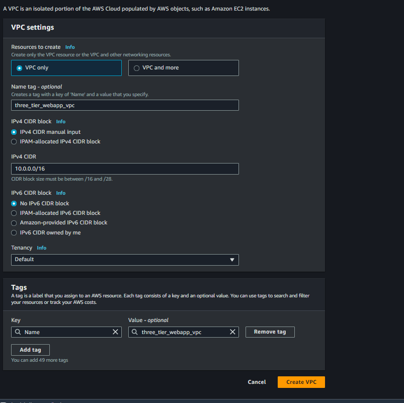 

### Creation of Subnets

Subnets are subdivisions within a VPC that allow you to organize and isolate resources within your network. Each subnet resides in a single Availability Zone (AZ) and enables you to segment your VPC's network into distinct logical groups for better security and management.

To create the necessary subnets for my project, I navigated to "Subnets" on the left side of the VPC dashboard and clicked "Create subnet." For this project, I needed six subnets spread across two availability zones. This setup ensures high availability and fault tolerance by distributing resources across multiple AZs.

Each availability zone houses three subnets, corresponding to the three layers of our three-tier architecture: public web, private app, and private database. Here are the names and configurations for the six subnets:

1. ThreeTierWebapp_PublicWeb-AZ1(a)
2. ThreeTierWebapp_PublicWeb-AZ2(b)
3. ThreeTierWebapp_PrivateApp-AZ1(a)
4. ThreeTierWebapp_PrivateApp-AZ2(b)
5. ThreeTierWebapp_PrivateDB-AZ1(a)
6. ThreeTierWebapp_PrivateDB-AZ2(b)

For each subnet, I specified the VPC created earlier (three_tier_webapp_vpc), selected the appropriate availability zone, and assigned an appropriate CIDR range (/24). This precise configuration ensures that each tier of the architecture is properly isolated and configured for optimal performance and security.


### Adding Internet Gateway (IGW)

An Internet Gateway (IGW) is a horizontally scaled, redundant, and highly available VPC component that allows communication between instances in your VPC and the internet. It serves as a gateway for outbound internet traffic from the VPC instances and inbound traffic from the internet to the VPC instances. Attaching an IGW to your VPC provides a path for network traffic to flow to and from the internet.

To provide the public subnets in my VPC with internet access, I needed to create and attach an Internet Gateway. Here's how I did it:

I navigated to "Internet Gateway" on the left-hand side of the VPC dashboard. I created the internet gateway by giving it a name and clicking "Create internet gateway." I named it ThreeTierWebApp_IGW.

After creating the internet gateway, I attached it to the VPC I created in the VPC and Subnet Creation step of the Project. This can be done either through the creation success message or by using the "Actions" drop-down menu. I selected Attach to VPC, chose the three_tier_webapp_vpc from the list, and clicked "Attach internet gateway" to complete the process. This setup allowed my public subnets to have the necessary internet access for the project.y
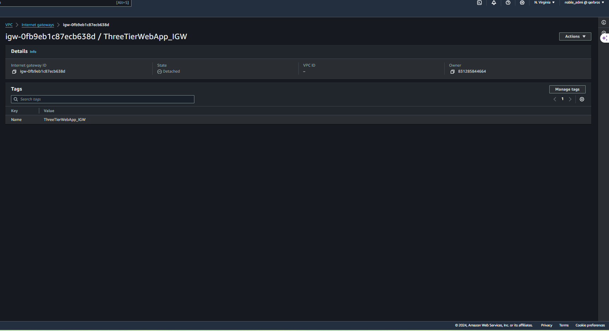

VPC Attachment

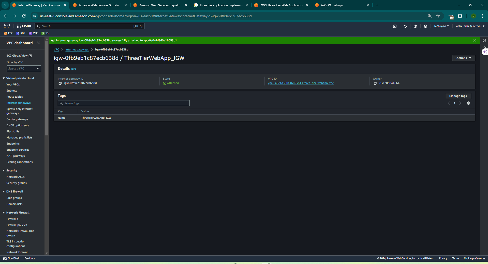

### NAT Gateway  (Network Address Translation Gateway) Creation

A NAT Gateway (Network Address Translation Gateway) enables instances in a private subnet to connect to the internet or other AWS services while preventing the internet from initiating connections with those instances. This is essential for instances that do not have a public IP address but still need to access external resources for updates or other services.

To allow my instances in the app layer private subnet to access the internet, I needed to create NAT Gateways. For high availability, I deployed one NAT Gateway in each of my public subnets. Here's how I did it:

I navigated to "NAT Gateways" on the left side of the VPC dashboard and clicked "Create NAT Gateway." I filled in the name ThreeTierWebapp_NGW_AZ1, chose one of the public subnets created earlier (ThreeTierWebapp_PublicWeb-AZ1(a)), and allocated an Elastic IP. Then, I clicked "Create NAT gateway."

Next, I repeated the process for the other public subnet. I created another NAT Gateway named ThreeTierWebapp_NGW_AZ2, selected the second public subnet (ThreeTierWebapp_PublicWeb-AZ2(b)), and allocated an Elastic IP. This ensured that instances in the app layer private subnets could access the internet for necessary updates and services, while maintaining high availability across different availability zones.

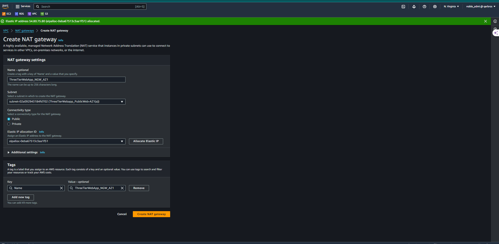

The two Gateways are added Successfully with two Elastic IPs (Public Static IPs)

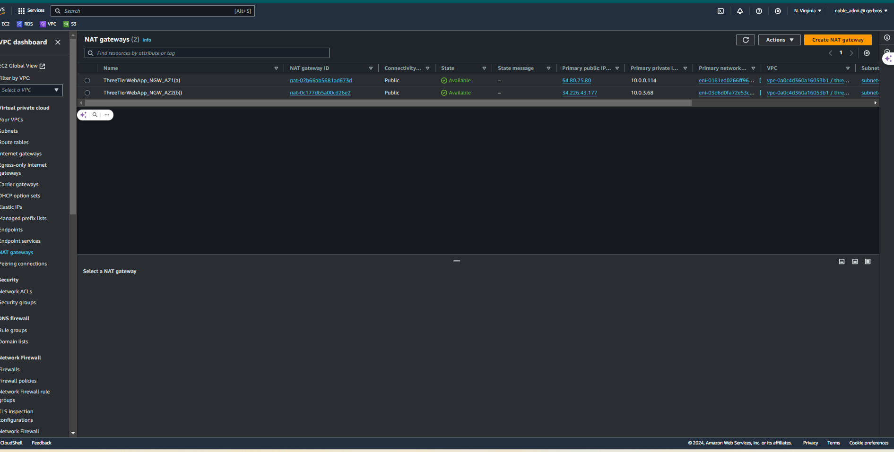

### Routing Configuration
At this stage, I want to create route table in order to directs traffic in my Infratructure to the right resource. A default route table is already created during the creation of the VPC which aids in establishing Private routing between resources in the Network. This route does not see Public Traffic.

Default Routes can be seen below with its details 
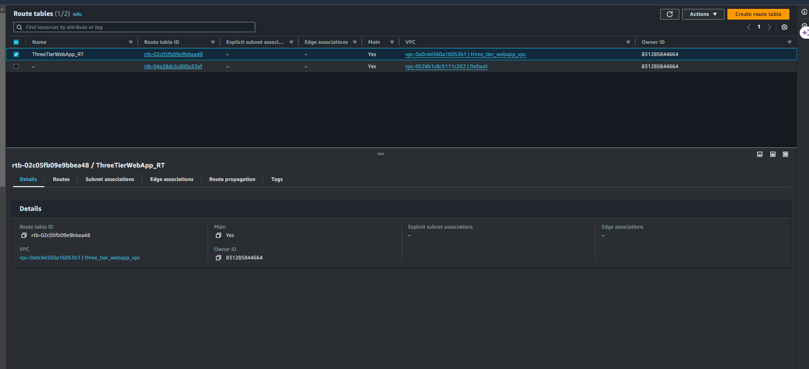

#### Adding of Public Routes

First, I created one route table named ThreeTierWebApp_Public_RT for the web layer public subnets. After creating the route table, I added a route that directs traffic from the VPC to the internet gateway. This ensures that any traffic destined for IPs outside the VPC CIDR range is directed to the internet gateway as a target, allowing instances in the public subnets to access the internet.
Next, I edited the Explicit Subnet Associations of the route table by selecting the two web layer public subnets (ThreeTierWebapp_PublicWeb-AZ2(b) and ThreeTierWebapp_PublicWeb-AZ1(a)) and saving the associations. This step ensures that the route table is associated with the correct subnets.


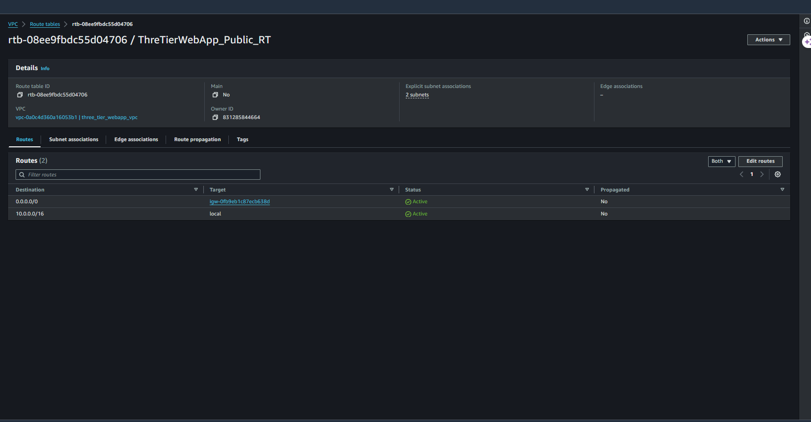

#### Adding of Private Routes

For the app layer private subnets, I created two more route tables: ThreeTierWebApp_PrivateApp_AZ1(a)_RT and ThreeTierWebApp_PrivateApp_AZ2(b)_RT. These route tables route app layer traffic destined for outside the VPC to the NAT gateway in the respective availability zone. I added the appropriate routes for each route table and associated them with the corresponding private subnets (ThreeTierWebapp_PrivateApp-AZ1(a) and ThreeTierWebapp_PrivateApp-AZ2(b)).

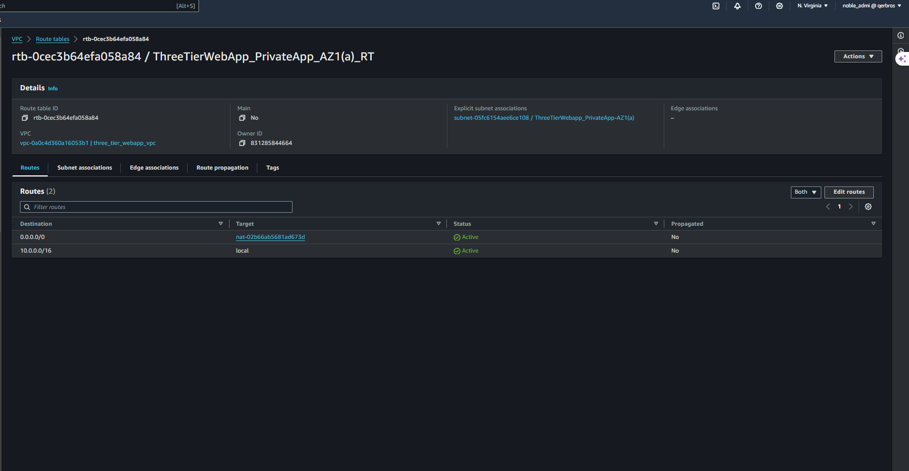

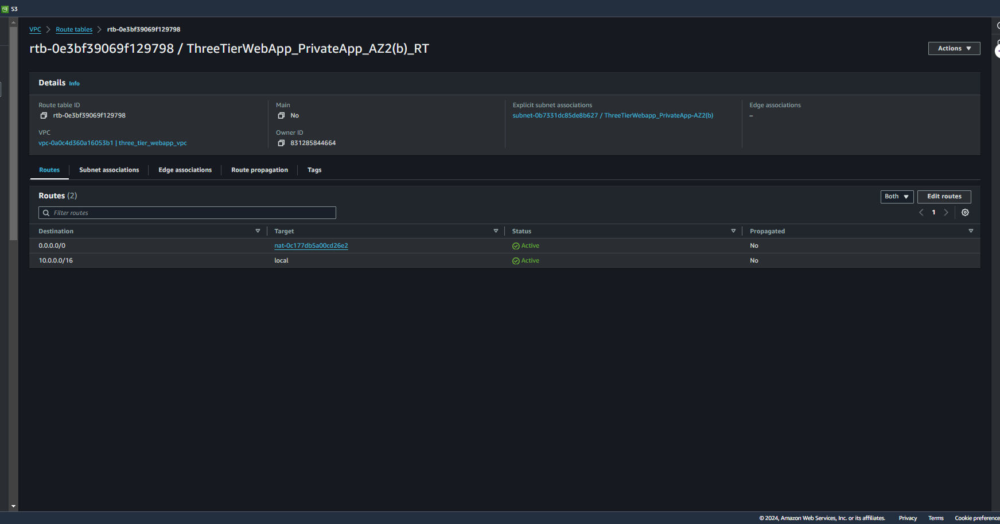

By configuring routing in this manner, I ensured that traffic flows efficiently and securely between the different layers of my three-tier architecture and between the VPC and external networks.

### Security Groups

Security Groups
Security groups act as virtual firewalls that control the inbound and outbound traffic for your instances. They define which traffic is allowed to access your instances based on rules that you specify.

1. Public Load Balancer Security Group: This security group is for the public, internet-facing load balancer. I created a security group and added an inbound rule to allow HTTP traffic. This rule allows incoming traffic on port 80 from my IP address.

2. Public Web Tier Instances Security Group: This security group is for the public instances in the web tier. I created a security group and added inbound rules to allow HTTP traffic from both the internet-facing load balancer security group and my IP address. This setup ensures that traffic from the public-facing load balancer can reach the instances, and I can access the instances for testing.

4. Internal Load Balancer Security Group: This security group is for the internal load balancer. I created a new security group and added an inbound rule to allow HTTP traffic from the public web tier instances security group. This allows traffic from the web tier instances to reach the internal load balancer.

5. Private App Tier Instances Security Group: This security group is for the private instances in the app tier. I created a security group and added inbound rules to allow TCP traffic on port 4000 from the internal load balancer security group and my IP address. This configuration allows the internal load balancer to forward traffic on port 4000 to the private instances, and I can access the instances for testing.

6. Private Database Instances Security Group: This security group protects the private database instances. I added an inbound rule to allow traffic from the private app tier instances security group to the MySQL/Aurora port (3306). This rule ensures that only traffic from the app tier instances can access the database instances.

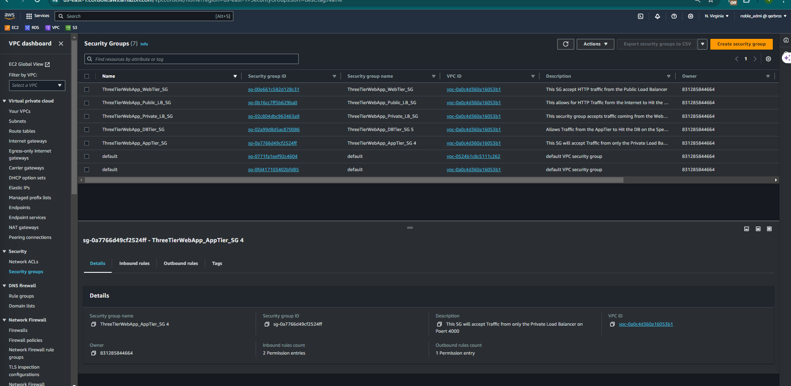

Detailed Explanation can be find the Video below

# My Video

Here is a video embedded directly in the Markdown file:

<iframe src="https://drive.google.com/file/d/1V11c90i-I1qoUKswBaqd0ZmHFr6zm6Qh/preview" width="640" height="480" allow="autoplay"></iframe>


[](https://drive.google.com/file/d/1V11c90i-I1qoUKswBaqd0ZmHFr6zm6Qh/view?usp=drive_link)


## PART 2: DATABASE DEPLOYMENT

In the RDS Dashboard, the first thing to be done is the creation of the DB subnet group.

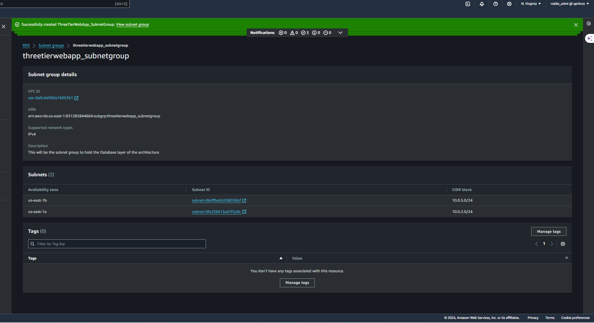

### Database Deployment

Amazon RDS (Relational Database Service) is a managed database service provided by AWS that makes it easier to set up, operate, and scale relational databases in the cloud. It supports multiple database engines, including MySQL, PostgreSQL, Oracle, SQL Server, and Amazon Aurora.

Aurora is a MySQL and PostgreSQL-compatible relational database built for the cloud, offering greater performance, scalability, and reliability compared to traditional database solutions. It is fully compatible with MySQL and PostgreSQL, making it easy to migrate existing applications to Aurora.

When creating an RDS Aurora database, you have various configuration options to choose from to meet the requirements of your workload, including database engine version, instance class, storage type, backup retention period, and multi-AZ deployment for high availability.


RDS (Relational Database Service)
Amazon RDS (Relational Database Service) is a managed database service provided by AWS that makes it easier to set up, operate, and scale relational databases in the cloud. It supports multiple database engines, including MySQL, PostgreSQL, Oracle, SQL Server, and Amazon Aurora.

Aurora is a MySQL and PostgreSQL-compatible relational database built for the cloud, offering greater performance, scalability, and reliability compared to traditional database solutions. It is fully compatible with MySQL and PostgreSQL, making it easy to migrate existing applications to Aurora.

When creating an RDS Aurora database, you have various configuration options to choose from to meet the requirements of your workload, including database engine version, instance class, storage type, backup retention period, and multi-AZ deployment for high availability.

**Database Creation Details**

I began by selecting "Standard Create" and opting for Aurora (MySQL Compatible Version) for the ThreeTierWebApp project's database. Choosing the "Dev/Test" template was the next step, aligning the setup with test and development workloads. I assigned the DB Cluster Identifier as "ThreeTierWebApp-Cluster2" and configured the master user as "antwinob"  to manage access securely. To enhance security measures, I enabled encryption managed by AWS Secrets Manager.

I selected Aurora Standard and opted for the Memory Optimized Class (db.r5.xlarge) with 4 vCPUs and 32GB RAM to ensure optimal performance. High availability and fault tolerance were achieved by enabling Multi-AZ deployment. Associating the database with the ThreeTierWebApp VPC and selecting the appropriate DB subnet group ensured proper network configuration.

To enhance security further, I disabled public accessibility for the database, limiting access to authorized resources only. Additionally, I configured the security group for the DB tier to control inbound and outbound traffic effectively. With these configurations, the RDS Aurora database meets the requirements of the ThreeTierWebApp project, ensuring high performance, availability, and security for the application's data storage needs.


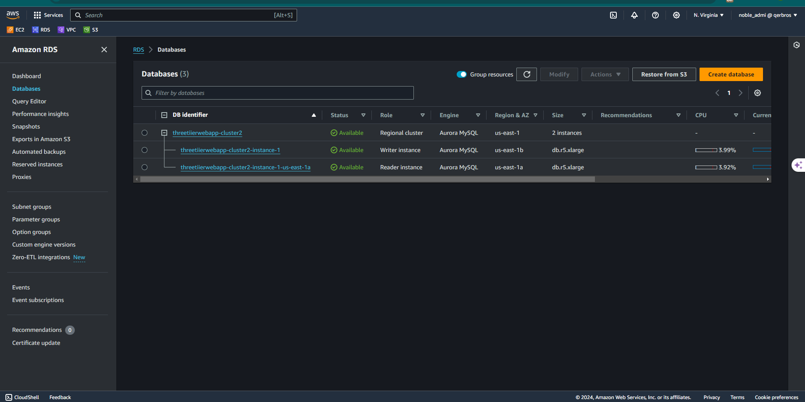

After the creation, the Reader instance was located in the us-east-1a zone, while the Writer instance was located in the us-east-1b zone.

The writer Endpoint is threetiierwebapp-cluster2.cluster-cftuljbvbg8h.us-east-1.rds.amazonaws.com, while that of the reader endpoint is threetiierwebapp-cluster2.cluster-ro-cftuljbvbg8h.us-east-1.rds.amazonaws.com.


### App Tier Instance Deployment
In this section, we will create an EC2 instance for our app layer and make all necessary software configurations so that the app can run. The app layer consists of a Node.js application that will run on port 4000. We will also configure our database with some data and tables.

## PART 3: APP TIER INSTANCE DEPLOYMENT


In the slection I will create an EC2 instance for our app layer and make all necessary software configurations so that the app can run. The app layer consists of a Node.js application that will run on port 4000. We will also configure our database with some data and tables.

After Opening the EC2 console, 
1. i selected Amazon Linux 2 AMI of  T.2 micro instance type
2. For key pair, i proceeded with a Key pair as the SSM role created will be attached to the VM in order to have access to it on the console directly.
2. Network Settings, I pick the ThreeTiwerWebApp_VPC nd then for the Subnet, since it is an App layer instance, I slected the ThreeTierWebapp_PrivateApp-AZ1(a) subnet. When it comes to the security group, i selected the one created for the app layer as ThreeTierWebApp_AppTier_SG
3. The instance will have na IAM Instance Profile attached. The name for the IAM instance role is *three-tier-webapp-EC2-SSN-S3*
Details of the Role Created are attached below which has two policies

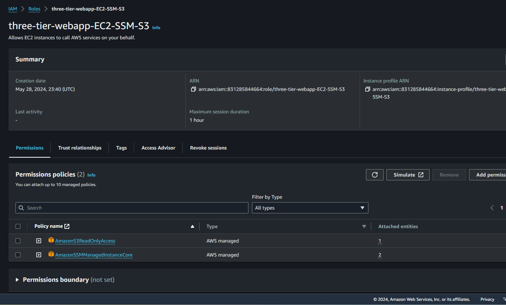

The first Vm of the App layer below
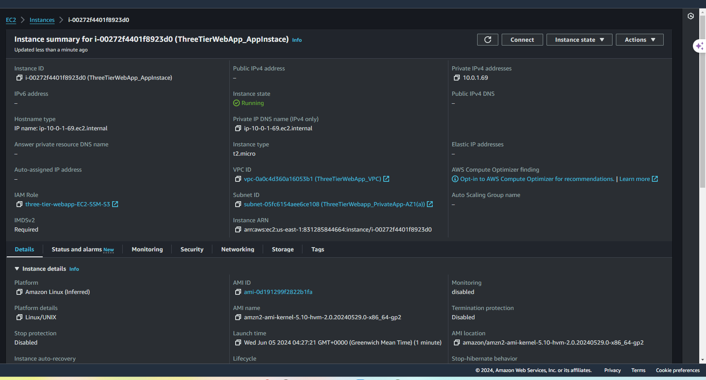


I tested the app instance to ensure it is able to reach the intenet via the NAT Gateway by pinging 8.8.8.8 after i logged into the iinstance using the SSM option

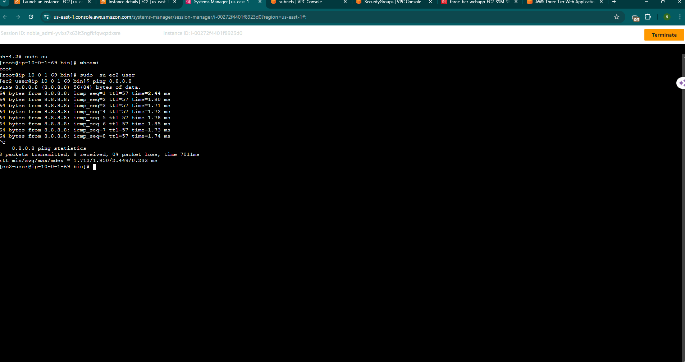

###  Configuring The  Database
On the same App instance EC2 console, I proceeded to download the MySQL CLI uisng the command
```
sudo yum install mysql -y
```
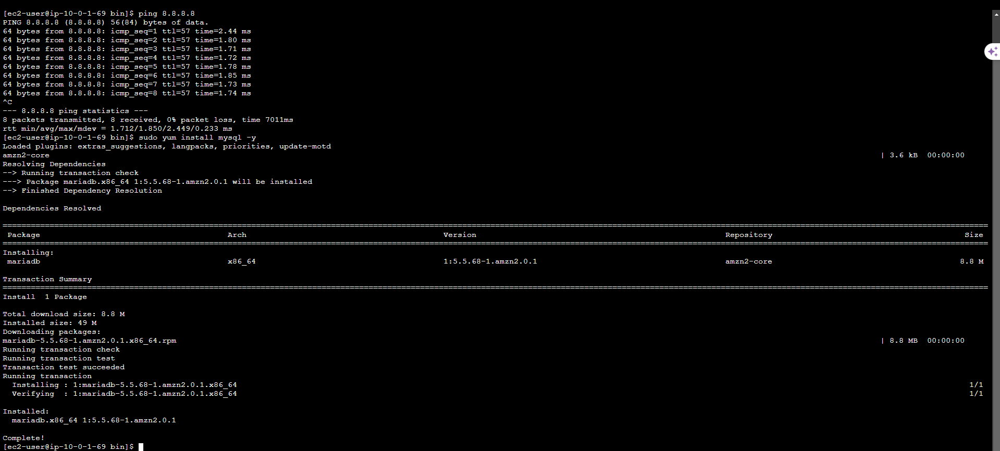

In order to initiate DB connection with your Aurora RDS writer endpoint.

```
mysql -h threetiierwebapp-cluster2.cluster-cftuljbvbg8h.us-east-1.rds.amazonaws.com -u antwinob -p

```


Connection to the DB has been established after typing in the password

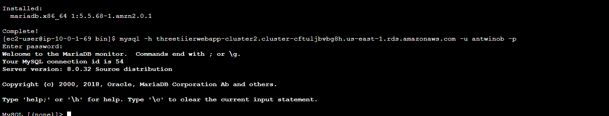

The next thing is to create a database with which we can interract with. The name of the DB to be created is **webappdb** which will be created with the command ``CREATE DATABASE webappdb;``   

After the DB was created, a table was also created using the command

``` sql
CREATE TABLE IF NOT EXISTS transactions(id INT NOT NULL
AUTO_INCREMENT, amount DECIMAL(10,2), description
VARCHAR(100), PRIMARY KEY(id));    
```

Data was inserted into the table using the command

```sql
INSERT INTO transactions (amount,description) VALUES ('400','groceries');   

```
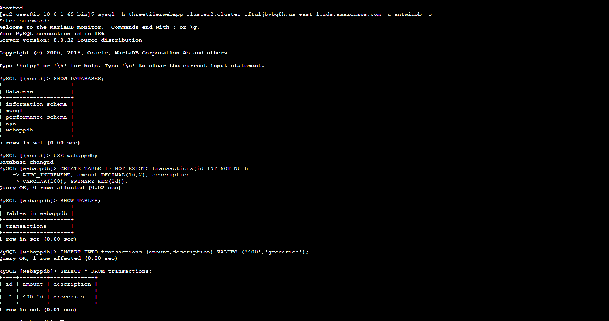

### Configure App Instance

The first thing we will do is update our database credentials for the app tier. To do this, open the application-code/app-tier/DbConfig.js file from the github repo in your favorite text editor on your computer. You’ll see empty strings for the hostname, user, password and database. Fill this in with the credentials you configured for your database, the writter endpoint of your database as the hostname, and webappdb for the database. Save the file.
NOTE: This is NOT considered a best practice, and is done for the simplicity of the lab. Moving these credentials to a more suitable place like Secrets Manager is left as an extension for this Project.

### Test App Tier

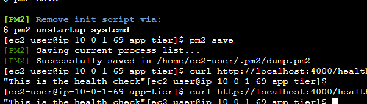


#### Testingin Database Connection

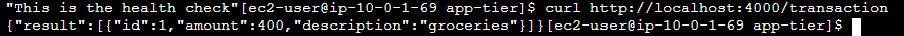


### Internal Load Balancing and Auto Scaling

The first thing to be done is to create an AMI of the first App Tier Instance.


I selected the ThreeTierWebApp_AppInstace and then oepn the Image and Tmeplates option. The name givent to the App Tier AMI is ThreeTierWebapp_AppTierImage


### Creation of a Target Group

A target group in AWS is a collection of endpoints or servers to which an Elastic Load Balancer (ELB) routes traffic. These endpoints, known as targets, can include EC2 instances, IP addresses, or AWS Lambda functions. Target groups are used to route requests based on specific protocols and port numbers, and they are closely associated with Application Load Balancers (ALBs), Network Load Balancers (NLBs), and VPC Lattice configurations. Each target group is defined by a set of health check parameters to monitor the health of the targets and ensure efficient traffic distribution .

In this Project, our endpint will be EC2 instances.
The Target Group name is **ThreeTierWebApp-AppTierTargetGrp** with the selcted protocol of HTTP and running on port 4000 which is the port the  Node.ja app is running on. The health check path has also been updated to  **/health** after selecting the right VPC, **ThreeTierWebApp_VPC**. The specified targets will not be added now as we have not created the EC2 instances moreso, I will be making use of autoscaling group.
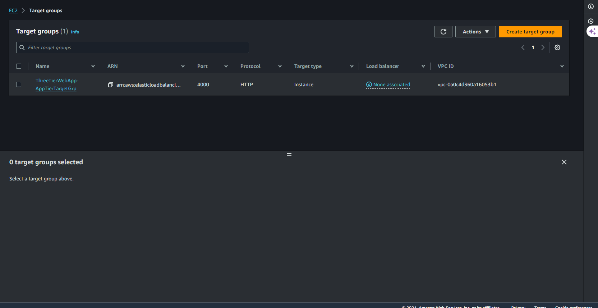

## Working with Load Balancers

Load balancers in AWS distribute incoming application traffic across multiple targets, such as Amazon EC2 instances, containers, and IP addresses, to ensure reliability and high availability. AWS offers three types of load balancers:

1. Application Load Balancer (ALB): Operates at the application layer (Layer 7) and provides advanced routing capabilities based on content. It is ideal for web applications and microservices, supporting features like host-based and path-based routing.

2. Network Load Balancer (NLB): Operates at the transport layer (Layer 4) and is designed for ultra-high performance and low latency. It can handle millions of requests per second and is suited for handling TCP and UDP traffic.

3. Gateway Load Balancer (GLB): Enables deployment, scaling, and management of third-party virtual appliances, such as firewalls, intrusion detection and prevention systems. It combines the capabilities of ALB and NLB.

**Best practices for using AWS load balancers include**

1. Health Checks: Configure health checks to monitor the status of your targets and ensure traffic is only sent to healthy instances.
Security Groups: Use security groups to control traffic flow to and from your load balancers.

2. Auto Scaling: Integrate with Auto Scaling to dynamically adjust the number of instances in response to traffic changes.

3. Cross-Zone Load Balancing: Enable cross-zone load balancing to distribute traffic evenly across all targets in different Availability Zones.
Overall, AWS load balancers improve the fault tolerance and scalability of applications by evenly distributing incoming traffic and ensuring efficient resource utilization.

## PART 4: INTERNAL LOAD BALANCING AND AUTO SCALING

For our HTTP Traffic, we will use an Application Load Balancer. The name given to this Load Balancer is **ThreeTierWebApp-ApTieInternal-LB**. The Load balancer will not be receigin internet trafic hence will make it internal.
The two availabilit zones are us-east-1a and us-east-1b
Under us-east-1a, i pick the Zone of ThreeTierWebapp_PrivateApp-AZ1(a) and then for us-east-1b a subnet of ThreeTierWebapp_PrivateApp-AZ2(b) was selected as indicated in the image below
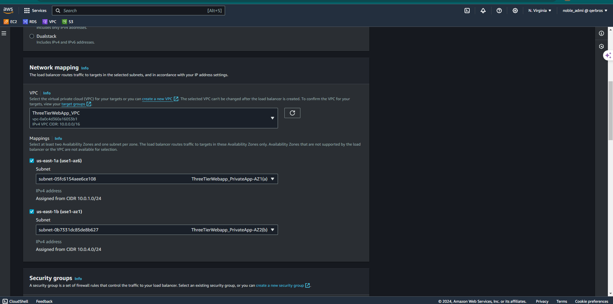. The security group of choice is **ThreeTierWebApp_Private_LB_SG** as this SG will only allow traffic from the  Public Tier EC2 instances. The ALB will be listening for HTTP traffic on port 80. It will be forwarding the traffic to our target group that we just created
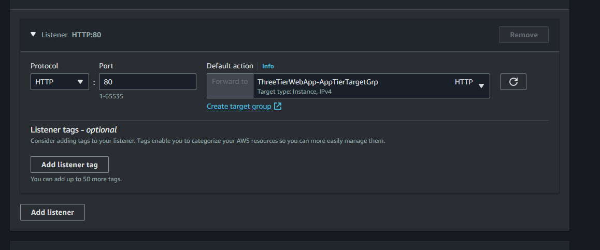

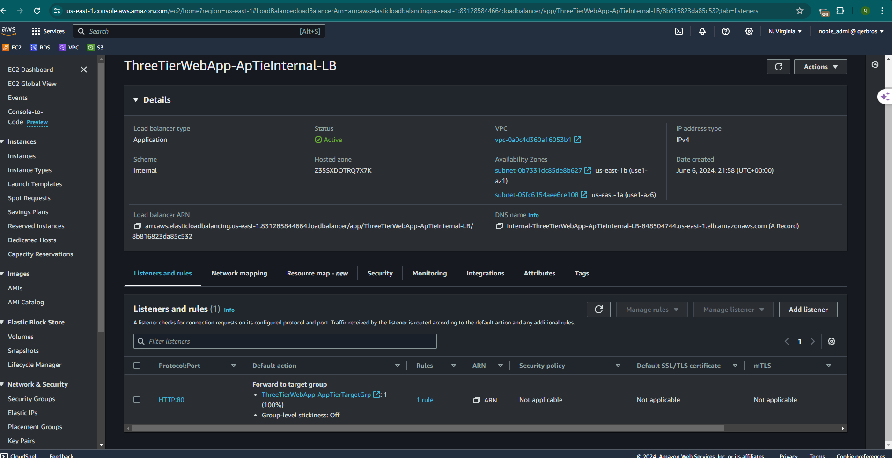

## Creating a Launch Template

An AWS Launch Template is a reusable blueprint for creating EC2 instances, simplifying the instance provisioning process by predefining configuration settings. It ensures uniform configurations across instances, streamlines the launch process, and supports version control for managing changes. Launch Templates integrate with Auto Scaling groups and other AWS services for automated and scalable deployments, enhancing efficiency, consistency, and manageability of EC2 instance provisioning.

The launch template created was named **ThreeTierWebApp_AppTierLunchTemplate**. In the Application and OS Images (Amazon Machine Image) secion, i  selcted the AMI created earlier for the App Tier. For the instance type, I picked the t2.micro.
In the Key Pair and Network Setting, we will not include them in the Template Creation. The App Tier Security Group was selected which was named **ThreeTierWebApp_AppTier_SG**. IN the advance section, the **three-tier-webapp-EC2-SSM-S3** role was attached as the IAM instance profile.

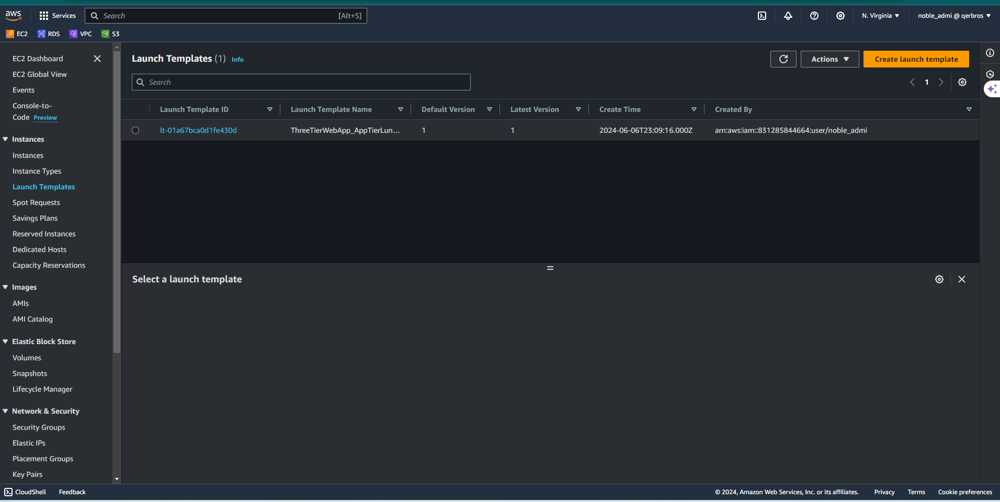

## Auto Scaling

AWS Auto Scaling automatically adjusts the number of EC2 instances in your application to maintain performance and cost-efficiency. It ensures that the right number of instances are running to handle the load for your application by dynamically scaling out during demand spikes and scaling in when demand decreases. Auto Scaling integrates with Elastic Load Balancing to distribute traffic efficiently and uses health checks to replace unhealthy instances. It helps maintain application availability and optimizes costs by using only the necessary resources.
The name of the auto scaling group for the Applicatin Tier is **ThreeTierWebApp_AppTierASG** which the Launch template being **ThreeTierWebApp_AppTierLunchTemplate**
I then proceeded to select the created VPC of ****ThreeTierWebApp_AppTierLunchTemplate**** withe two private App Tier subnets namely *ThreeTierWebapp_PrivateApp-AZ1(a)* and *ThreeTierWebapp_PrivateApp-AZ2(b)*
In the advanced options section, i picked the option to attached a Load balancer where in the Target Group option, I selected the **ThreeTierWebApp-AppTierTargetGrp | HTTP** target i created for the Appliation Tier. I also check the option to Turn on Elastic Load Balancing Health Checks which ensure Instances are healthy before sending traffic to them.
When it comes to the group size and scaling option, these are the configurations
1. Desired Capacity = 2
2. Minnimum Desired Capacity = 2
3. Maximum Desired Capacity = 4
In the Auto scaling Policy, the choice of selection was Target Tracking Scaling Policy with a policy name of **ThreeTierWebApp_AppTierScalingPolicy** and a Metric type
 of Average CPU Utilization. Target value is set to 75 and Instance warmup set to 300 seconds. For replacement policy, mixed Behaviour was picked. In order to be alerted on the sstate of instances working with this auto scaling group, I set up a Simple Notifcation Service Topic in order to send laerts when events like, launch, temirnate, fail to launch and fail to temrinate occur as can be verified from the attached image.
 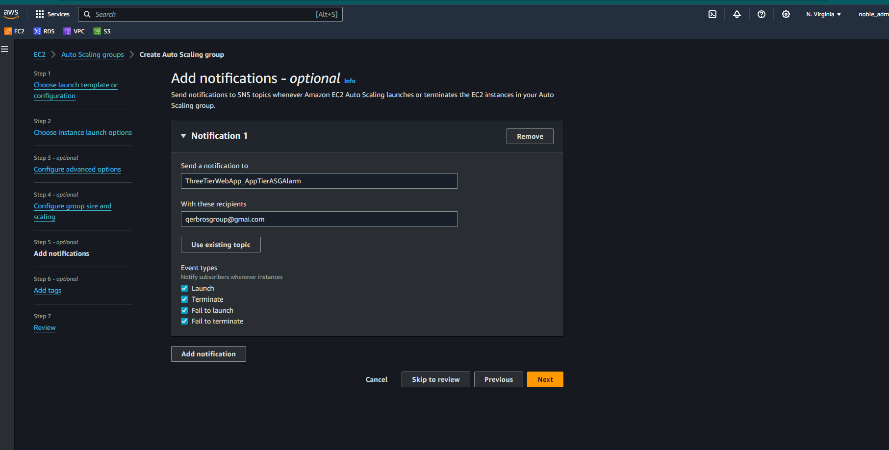

 The auto scaling group immediately get to work as it spins up two instances. The original instance created upon whcih the AMI was built has been turned off hence the AS spins up two which will be the desired capacity according to the configuration of the ASG as can be seen from the attached image below
 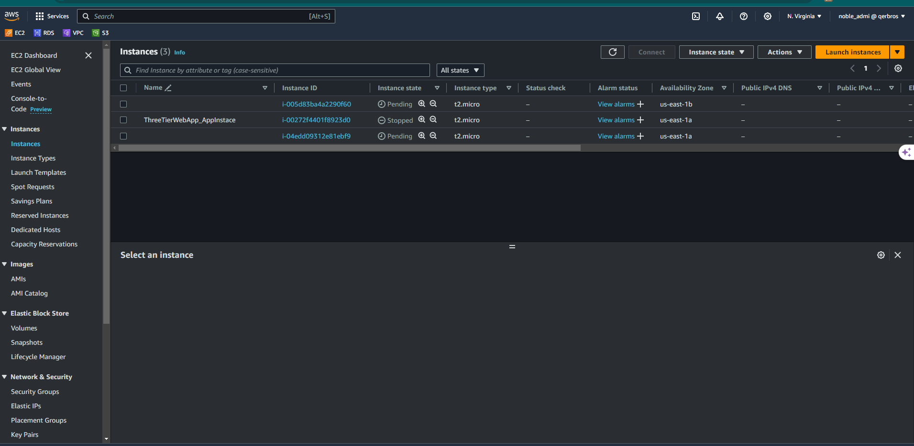

This is the confirmation of the creation of the Application Tier ASG from the Image Below
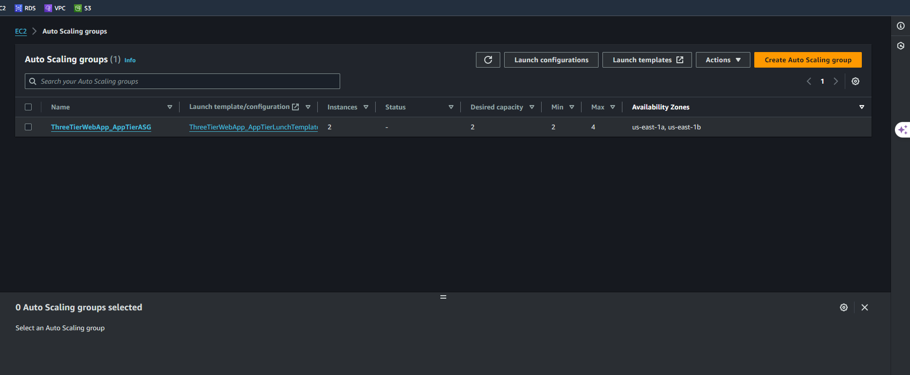


## PART 5 : WEB TIER INSTANCE DEPLOYEMNT
In this section, we will undertake the comprehensive deployment of an EC2 instance dedicated to the web tier. This process will encompass the provisioning of the instance, configuration of network settings, installation and configuration of the NGINX web server, and deployment of a React.js website. Detailed steps and considerations will ensure a robust and scalable web tier, crucial for the performance and availability of our application.

## updating The Config File
Before we create and configure the web instances, I have already made the necessary update to the application-code/nginx.conf file from the repository we downloaded. Specifically, at line 58, I replaced [INTERNAL-LOADBALANCER-DNS] with our internal load balancer’s DNS entry. You can verify this by navigating to your internal load balancer's details page. The DNS entry used is internal-ThreeTierWebApp-ApTieInternal-LB-848504744.us-east-1.elb.amazonaws.com.

Here's the updated section of the nginx.conf file:

```
upstream backend {
    server internal-ThreeTierWebApp-ApTieInternal-LB-848504744.us-east-1.elb.amazonaws.com;
}
```
With this configuration in place, NGINX is now set to route traffic to the correct internal load balancer, ensuring seamless communication within the web tier. Now we can proceed with creating and configuring the web instances.
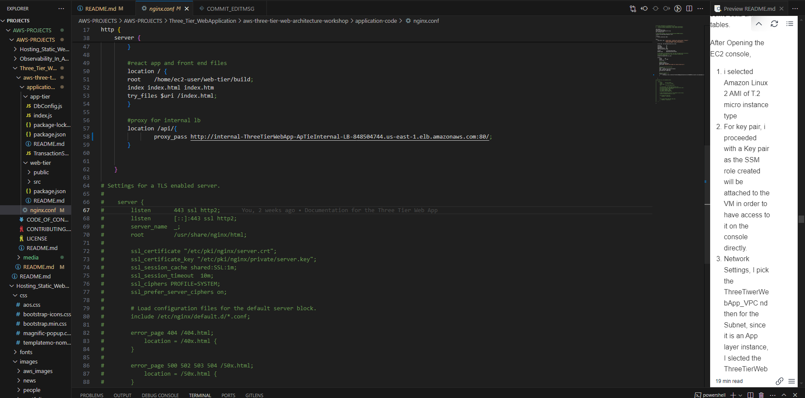

Next, I have uploaded this updated nginx.conf file along with the entire application-code/web-tier folder to the S3 bucket we created for this lab. This ensures all necessary files are centrally stored and easily accessible for the deployment process. This can be seen from the image below

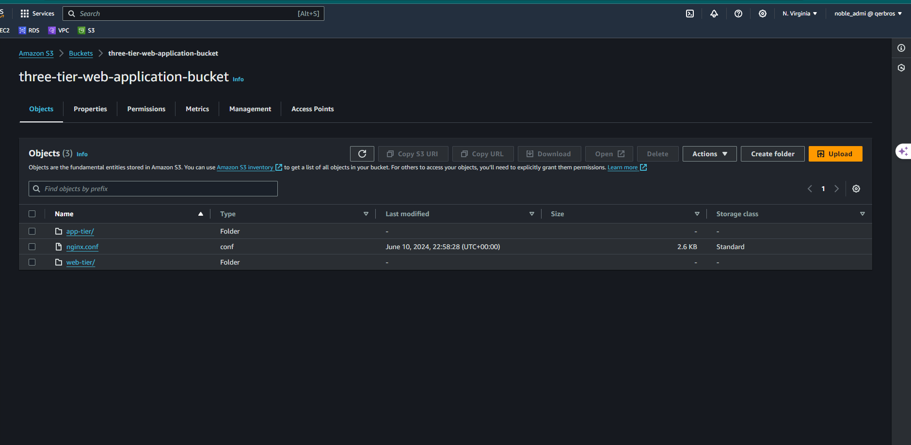

### Web Instance Deployment
Now it's time to deploy our web instance! We'll follow a similar process to the one we used for the App Tier instance in Part 3, with a few important differences to tailor this instance for the web tier. Here's how I set everything up:

**1. Instance Creation:**

    a. AMI: I selected the Amazon Linux 2 AMI, which provides a stable and secure environment for our web server.
    b. Instance Type: I chose the t2.micro instance type to keep costs low while maintaining adequate performance for our web tier.

**2. Configure Instance Details::**
    Now it's time to deploy our web instance! We'll follow a similar process to the one we used for the App Tier instance in Part 3, with a few important differences to tailor this instance for the web tier. Here's how I set everything up:

First, I selected the Amazon Linux 2 AMI, which provides a stable and secure environment for our web server. I chose the t2.micro instance type to keep costs low while maintaining adequate performance for our web tier. For the network selection, I switched from the Default VPC to the ThreeTierWebApp_VPC we created earlier. This ensures our instance is part of the same network architecture as the rest of our application. Since this will be a public-facing instance, I provisioned it in one of our public subnets and enabled the option to auto-assign a public IP address, making our web instance accessible to users.

I selected the three-tier-webapp-EC2-SSM-S3 IAM role, which includes the AmazonS3ReadOnlyAccess and AmazonSSMManagedInstanceCore policies. This allows us to manage the instance using Session Manager and access S3 in a read-only capacity. For security, I chose the ThreeTierWebApp_WebTier_SG security group. This group has two inbound rules: one that allows access from my personal IP for testing purposes, ensuring I can securely access the instance while configuring and testing it, and another that allows access from the Public Facing Load Balancer, enabling our web traffic to be properly routed.

To keep things organized, I tagged the instance with the name ThreeTierWebApp_WebInstance, making it easy to identify in the AWS Management Console. I configured the storage with an 8 GB EBS volume, which is sufficient for the operating system and initial web server setup. This can be adjusted later based on our website's requirements.

In the Advanced Details section, I ensured the IAM instance profile was set to the three-tier-webapp-EC2-SSM-S3 role. This enables access to the instance using AWS Systems Manager Session Manager, allowing for easy and secure management without the need for a key pair. I left all other options in their default state, reviewed all settings carefully, and then launched the instance.

With these settings, the instance has been created and is now up and running, ready to handle web traffic for our application. This careful configuration ensures that our web tier is both accessible and secure, setting the stage for a robust and reliable deployment.
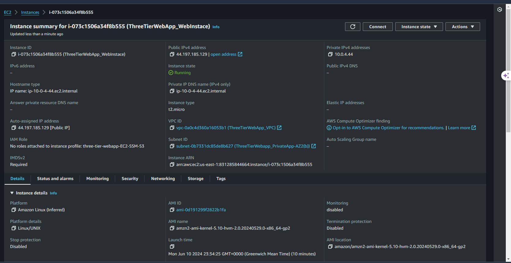

### Connect to Instance
First, I opened the AWS Management Console and navigated to the EC2 dashboard. From there, I selected the ThreeTierWebApp_WebInstance and used the Session Manager to connect, thanks to the IAM role three-tier-webapp-EC2-SSM-S3 that we assigned earlier.

Once connected, I switched to the ec2-user by running the following command:
```
sudo -su ec2-user
```
With the ec2-user session active, I tested the internet connectivity by pinging Google's public DNS server: 
```
With the ec2-user session active, I tested the internet connectivity by pinging Google's public DNS server:
```
The pings were successful, confirming that the instance has internet connectivity. This is an important step to ensure that our web instance can reach external resources and updates.

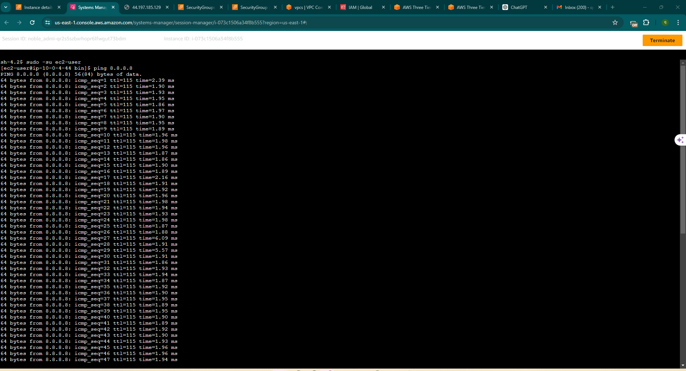

## Configure Web Instance
To ensure our web instance is fully equipped to run our front-end application, I installed NVM (Node Version Manager) and Node.js, the JavaScript runtime environment. Here's a breakdown of the installation process:

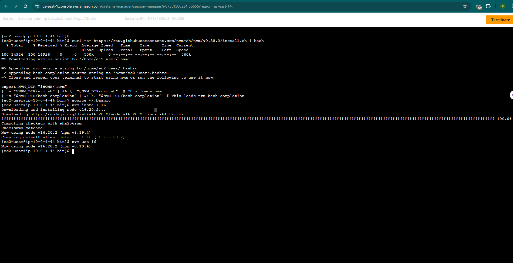
1. Install NVM:
 ```
curl -o- https://raw.githubusercontent.com/nvm-sh/nvm/v0.38.0/install.sh | bash
```
his command fetches the installation script for NVM from its GitHub repository and executes it using bash, enabling us to manage multiple Node.js versions effortlessly.

2. Apply Changes:
```
source ~/.bashrc
```
After NVM installation, I sourced the ~/.bashrc file to apply the changes made by the installation script. This ensures that NVM commands are available in the current shell session.

3. Install Node.js:
```
nvm install 16

```
With NVM set up, I installed Node.js version 16, the latest LTS (Long-Term Support) version at the time, using the command above. This version is recommended for its stability and long-term support.

4. Activate Node.js:
```nvm use 16```
Finally, I activated Node.js version 16 with the nvm use command. This sets the installed Node.js version as the default for the current shell session, ensuring that any Node.js-related commands and applications will use version 16.

By following these steps, our web instance is now fully prepared with NVM and Node.js, ready to run our front-end application and handle any related tasks efficiently.

To download our web tier code from the S3 bucket, I executed the following commands:

1. Navigate to Home Directory:


``cd ~/``
This command changes the current directory to the home directory (~/) to ensure we're in the right location to download the code.

2. Download Web Tier Code:
``   aws s3 cp s3://three-tier-web-application-bucket/web-tier/ web-tier --recursive``

Using the AWS CLI (aws s3 cp), I copied all the files and directories from the specified S3 bucket path (s3://three-tier-web-application-bucket/web-tier/) to a local directory named web-tier. The --recursive flag ensures that all subdirectories and their contents are downloaded as well.

With these commands, our web tier code has been successfully downloaded from the S3 bucket and is now available locally in the web-tier directory for further configuration and deployment.

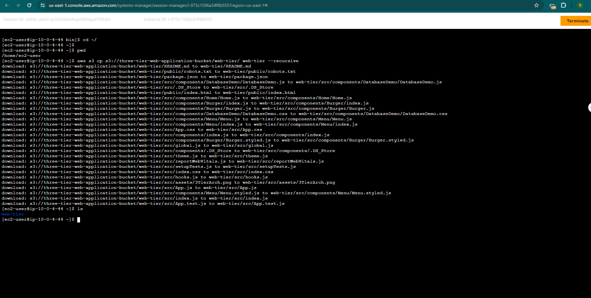

To navigate to the web-layer folder, create the build folder for the React app, and prepare our code for serving, I executed the following commands:
1. Navigate to Web Tier Directory:

``cd ~/web-tier``
This command changes the current directory to the web-tier directory where our web tier code has been downloaded.

2. Install Dependencies:
``npm install``
Using npm, I installed all the dependencies required for our React application. This ensures that all necessary libraries and packages are available for building our app.

3. Create Build Folder

``npm run build``

With the dependencies installed, I ran the build script (npm run build) to generate a production-ready build of our React application. This process compiles our React components, bundles JavaScript files, and optimizes assets for better performance.

By following these steps, our React app is now built and ready to be served. The build folder contains all the necessary files to deploy our web application and serve it to users.

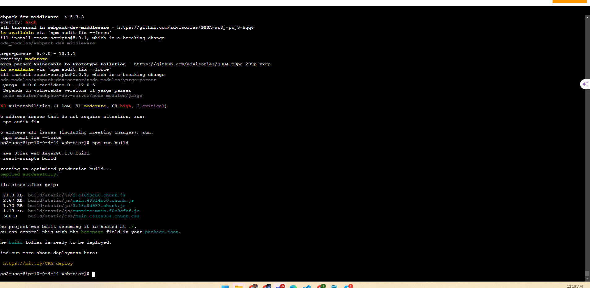

To configure NGINX as a web server to serve our application on port 80 and direct API calls to the internal load balancer, I installed NGINX using the following command:
```sudo amazon-linux-extras install nginx1 -y```
This command installs NGINX version 1 from the Amazon Linux Extras repository. -y is used to automatically answer "yes" to any prompts, ensuring that the installation process proceeds without manual intervention.
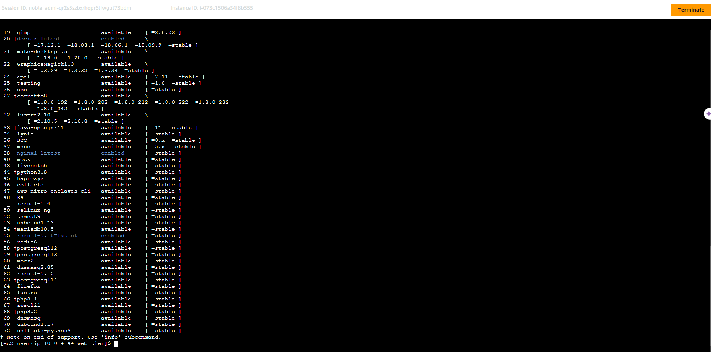

To navigate to the NGINX configuration directory and list the files, I executed the following commands:
```cd /etc/nginx
ls
```
This set of commands first changes the directory to /etc/nginx, where NGINX configuration files are typically located, and then lists the contents of that directory using the ls command. This allows us to see all the configuration files present in the NGINX directory.

To replace the default NGINX configuration file with the one uploaded to S3, I executed the following command:
``sudo rm nginx.conf``

``sudo aws s3 cp s3://three-tier-web-application-bucket/nginx.conf /etc/nginx/nginx.conf``
With these commands, we're removing the default NGINX configuration file and replacing it with the custom configuration file you uploaded to your S3 bucket.
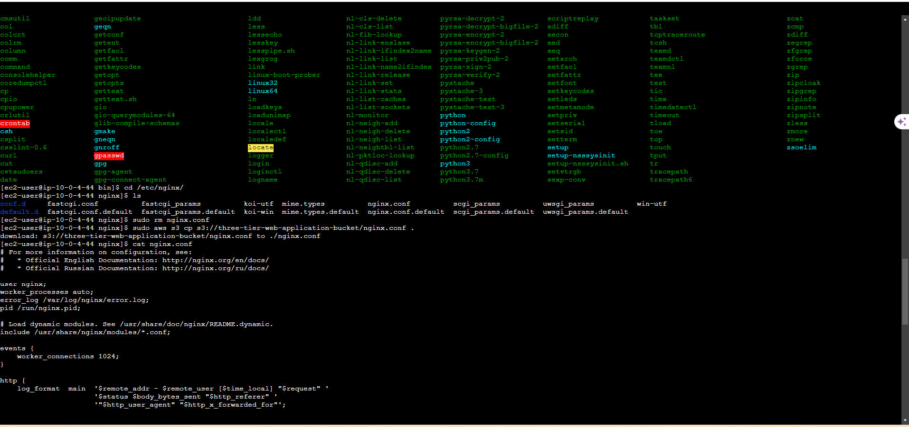

After configuring NGINX with the custom settings, I needed to restart the service and ensure it had the proper permissions to access our files. Here's how I did it:

First, I restarted NGINX to apply the new configuration:

``sudo service nginx restart``

This command ensures that NGINX uses the updated nginx.conf file we downloaded from the S3 bucket.

Next, I set the correct permissions for the files in the /home/ec2-user directory to make sure NGINX can access them:
``chmod -R 755 /home/ec2-user``

This step was crucial to avoid any permission issues that might prevent NGINX from serving our files properly.

To ensure that NGINX starts automatically whenever the instance reboots, I enabled it to start on boot:

``sudo chkconfig nginx on``
With NGINX configured and running, I plugged the public IP of my web tier instance into my browser. This IP can be found on the Instance Details page in the EC2 dashboard.

Seeing my website live was a great moment! If the database connection is set up correctly, the website not only displays but also allows interaction with the database. I tested this by adding some data, and it worked perfectly. However, I made sure to be careful with the delete button, as it would clear all entries in the database.

By following these steps, I successfully configured NGINX to serve my React application and handle API calls, ensuring a smooth deployment and functionality.
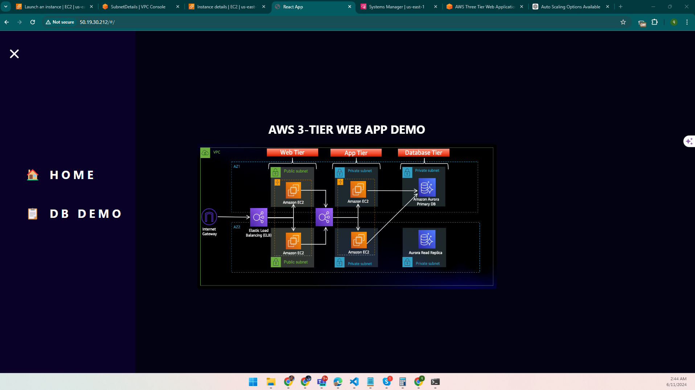

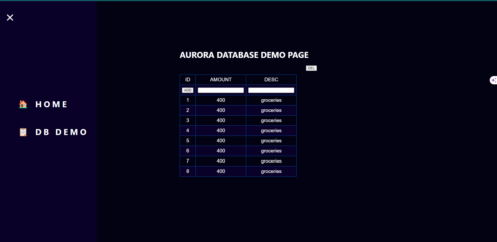

## PART 6 : EXTERNAL LOAD BALANCER AND AUTO SCALING

In this part of the Project, I will create an Amazon Machine Image (AMI) of the web tier instance I just set up. Using this AMI, I will configure an autoscaling group with an externally facing load balancer. This process will ensure that the web tier is highly available, automatically adjusting the number of instances to handle varying levels of traffic and providing a robust, scalable solution for my application.

### Web Tier AMI

To create an Amazon Machine Image (AMI) of the web tier instance, I first navigated to "Instances" on the left-hand side of the EC2 dashboard. I selected the web tier instance we created and, under "Actions," chose "Image and templates," then clicked "Create Image." I named the image ThreeTierWebApp-WebTierImage and added the description, "This will be the image for the web tier instances." After clicking "Create image," I waited a few minutes for the process to complete. To monitor the status of the image creation, I went to "AMIs" under the "Images" section on the left-hand navigation panel of the EC2 dashboard.
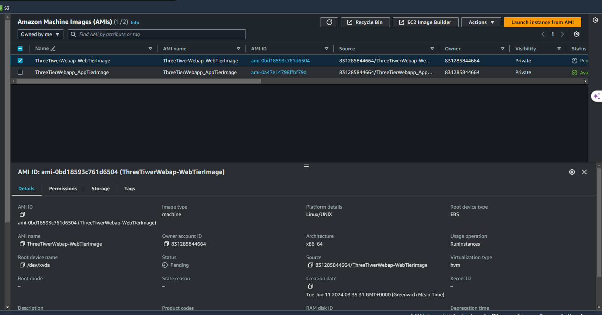

### Target Group

While the AMI was being created, I went ahead and created the target group to use with the load balancer. On the EC2 dashboard, I navigated to "Target Groups" under "Load Balancing" on the left-hand side and clicked on "Create Target Group."

The purpose of forming this target group was to balance traffic across my public web tier instances using the load balancer. I selected "Instances" as the target type and named it ThreeTierWebApp-WebTierTargetGrp.

I set the protocol to HTTP and the port to 80, which is the port NGINX is listening on. I selected the VPC ThreeTierWebApp_VPC and changed the health check path to /health.

After clicking "Next," I skipped the step to register any targets for now and proceeded to create the target group.


### Internet Facing Load Balancer

When creating the Internet Facing Load Balancer, I selected the Application Load Balancer option and named it "ThreeTierWebApp-WebTierExtn-LB," choosing "Internet facing" and IPv4 for IP addressing type, with the VPC set to "ThreeTierWebApp_VPC," and selected the appropriate subnets for each availability zone to ensure internet connectivity, and assigned the security group "ThreeTierWebApp_Public_LB_SG" allowing inbound traffic from my personal computer and the internet, while under the listeners section, I selected the target group "ThreeTierWebApp-WebTierTargetGrp" for routing HTTP traffic.
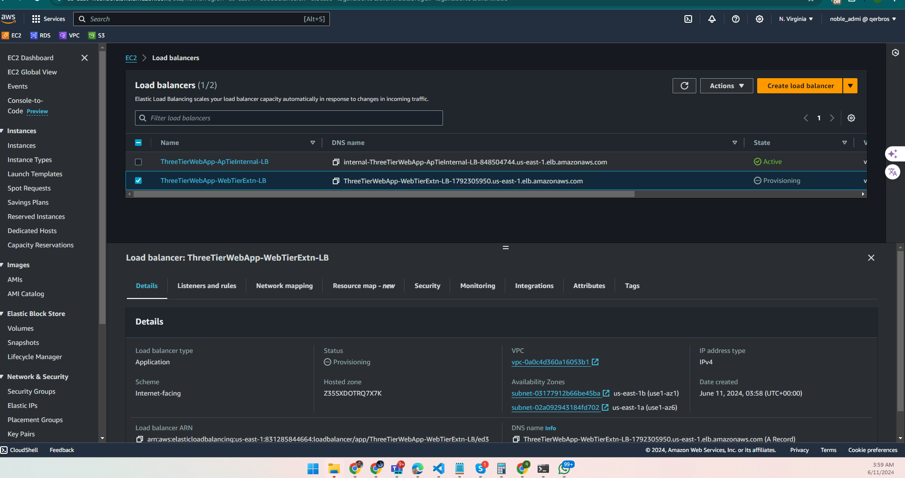

## Launch Template

To configure Auto Scaling, I first created a Launch template with the AMI we previously created. On the left side of the EC2 dashboard, I navigated to "Launch Template" under "Instances" and clicked "Create Launch Template."

I named the Launch Template "ThreeTierWebApp_WebTierLaunchTemplate" and included the Webb tier AMI we created earlier under "Application and OS Images."

For the instance type, I selected t2.micro, and I didn't include Key pair and Network Settings in the template since we don't need a key pair to access our instances, and network information will be set in the autoscaling group.

I set the correct security group for our web tier and, under Advanced details, used the same IAM instance profile we've been using for our EC2 instances.


### Auto Scaling

To create the Auto Scaling Group for our web instances, I navigated to "Auto Scaling Groups" under "Auto Scaling" on the left side of the EC2 dashboard and clicked "Create Auto Scaling group."

I named the Auto Scaling group "ThreeTierWebApp_WebTierASG" and selected the Launch Template we just created, which is "ThreeTierWebApp_WebTierLaunchTemplate."

Under the network section, I changed it to the "Three Tier Web App VPC" and selected the two public subnets: "ThreeTierWebapp_PublicWeb-AZ2(b)" and "ThreeTierWebapp_PublicWeb-AZ1(a)."

For the next step, I attached this Auto Scaling Group to the Load Balancer we just created by selecting the existing web tier load balancer's target group from the dropdown, which is "ThreeTierWebApp-WebTierExtn-LB."

In the capacity settings, I set the desired capacity to 2, minimum to 2, and maximum to 4.

I left every other option at its default value and then created the Auto Scaling group, as confirmed from the attached image.
This ensures two new servers are added as can be seen from the attached screen where they were Initializing


The application Should now be servered form teh DNS endpoint of the external Load Balancer 
```
ThreeTierWebApp-WebTierExtn-LB-1792305950.us-east-1.elb.amazonaws.com
```


The Full Video Representation of the running app can be found using the Link
[Click to Play](https://drive.google.com/file/d/1GQHy6nxwzfzSPL3F6-iOEPlcMoGBpyxD/view?usp=sharing)