# Using IAM Identity Center (Successor to AWS Single Sign-On) to Achieve Strong Identity Management

## Introduction

In this project, I explored how to utilize IAM Identity Center, the successor to AWS Single Sign-On (SSO), to implement strong identity management across a multi-account AWS environment. IAM Identity Center is a comprehensive solution designed to streamline and enhance user access control by centralizing identity management.

As organizations increasingly adopt cloud technologies, managing user identities and permissions effectively becomes crucial. IAM Identity Center provides a scalable and secure way to handle access control, ensuring that users are granted the appropriate permissions based on their roles and group memberships. This approach aligns with the principles of least privilege, which aims to minimize the risk by giving users only the access they need to perform their job functions.

By integrating IAM Identity Center, I was able to establish a robust access management framework that simplifies the configuration and enforcement of security policies. This project demonstrated how to set up IAM Identity Center to manage user access centrally, applying best practices for security and efficiency in a cloud-based infrastructure.

Through hands-on configuration and management, I gained valuable insights into how IAM Identity Center can be leveraged to support organizational security goals, enhance compliance, and streamline identity management processes across multiple AWS accounts.

## Scenario

A company is embarking on a new journey into AWS as part of its strategy to expand its cloud infrastructure. As part of this transition, the primary objective was to implement a robust and scalable system for managing security access across multiple AWS accounts. This involved setting up a centralized approach to control user permissions and access, ensuring that security measures are both stringent and manageable.

In my role as a cloud administrator, I was responsible for designing and configuring access controls using IAM Identity Center. The goal was to align access permissions with the company's organizational structure and project requirements. This meant creating access rules based on users' group memberships and their roles within various projects and teams.

Applying the principle of least privilege was critical in this setup. This principle ensures that users are granted only the permissions necessary for their specific tasks, minimizing potential security risks and maintaining a controlled access environment. By implementing IAM Identity Center, I aimed to streamline access management, reduce administrative overhead, and enhance overall security posture across the company's AWS accounts.

## AWS Account Setup

### AWS Account for Lab Exercises

Since I was preparing for the lab exercises, I needed to either use an existing AWS account or create a new one. For those using an existing account, it's crucial to understand any implications and corporate policies related to provisioning resources. Since my account wasn't part of AWS Organizations and I had administrator-level access, I could skip some initial setup tasks.

If I didn’t have an AWS account, I would need to create one. I started by signing up for a new AWS account through the [AWS sign-up page](https://aws.amazon.com/free/). To complete the sign-up, I provided payment information, like a credit card, and went through the verification process, which included receiving a phone call and entering a code.

> **Note:** If I were already signed into the AWS Management Console, I would have needed to sign out first. After signing out, I would have used [this link](https://aws.amazon.com/console/) to create a new account.

#### Preparing an IAM User for Lab Exercises

To prepare for the lab, I needed to set up an IAM User, since using the default root user isn’t recommended. Here’s what I did:

I signed in to my AWS account and navigated to the AWS IAM console. There, I created a new user by choosing a name (I used `noble_admin`), enabling "AWS Management Console access," and setting up a password.

Next, I configured the user’s permissions. I attached the `AdministratorAccess` policy to ensure that I had all the necessary permissions for the lab exercises. I reviewed the setup details and created the user. Finally, I sent the sign-in link to my email, which provided a unique URL to access the AWS Management Console for the new user.

With these steps completed, I was ready to proceed with the lab exercises, equipped with the proper setup and permissions.

## IAM Identity Center Prerequisites

## Getting Started with IAM Identity Center

Before diving into setting up IAM Identity Center, I needed to make sure I had a few prerequisites in place. Since I was working on a new setup, I followed these steps to ensure everything was ready:

> **Note:** If IAM Identity Center was already enabled in my AWS account, I could have skipped this section. However, I needed to set it up from scratch for this project.

To get started, I needed to have:

1. **An AWS Account with Administrator Access:** Since I already had an AWS account with admin privileges, I didn’t need to create a new one. However, if anyone else needed to, they would have done so by clicking [here](https://aws.amazon.com/console/).

2. **AWS Organizations Set Up with All Features Enabled:** To use IAM Identity Center, I had to ensure that AWS Organizations was set up with all features enabled. This required a few steps:
   
   **Enabling AWS Organizations**
   - In the AWS Console, I went to the top left corner and used the search box to type "AWS Organizations" and selected the service from the list.
   - I clicked on "Create Organization." By default, the organization was created with all features enabled, which was essential for my configuration.
   - After creation, the AWS accounts page appeared, showing only the management account under the root organizational unit (OU).
   - 

   **Enabling IAM Identity Center**
   - To enable IAM Identity Center, I opened the AWS Console, clicked "Services" in the top left corner, and then selected "IAM Identity Center" from the list.
   - I chose the "Enable" option to activate IAM Identity Center. Once enabled, IAM Identity Center created a service-linked role in all accounts within the organization, including any new accounts added later. This role allowed IAM Identity Center to access and manage resources across accounts.
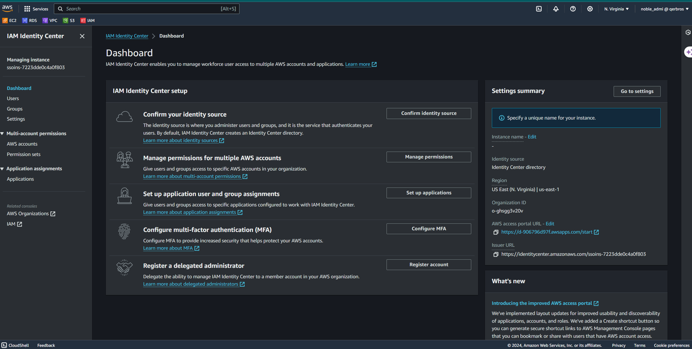

## Delegated Administration

IAM Identity Center also allowed me to designate a different member account within my AWS Organization for administrative tasks, rather than using the Organization Management Account. This setup was useful for delegating tasks and managing administrative responsibilities effectively.

## Creating Users and Groups in IAM Identity Center

In this section, I set up users and groups within the IAM Identity Center (formerly AWS Single Sign-On) identity store. This approach is suitable for managing identities directly through IAM Identity Center. 

### Choosing Your Identity Source

To begin, I selected the IAM Identity Center identity store for user and group management. This default setup provided a straightforward and effective way to manage identities. 

#### Managing Identities

Here’s how I created users and groups within the IAM Identity Center identity store:

1. **Creating Groups**

   For this setup, I needed two groups: `Administrators` and `readOnly`.

   - I navigated to the IAM Identity Center Console and selected **Groups**.
   - I clicked on **Create Group**.

     In the **Create group** page:

     - I entered the Group Name, `Administrators`.
     - I provided a Description,, `Group for administrator users`.
     - I clicked **Create group**.

   - I repeated the steps to create the `readOnly` group.

2. **Creating Users**

   Next, I created two users: `adminUser` and `readOnlyUser`.

   - I navigated to the IAM Identity Center Console and selected **Users** under the Workplace pool.
   - I clicked **Add User**.

     In the **Add User** page:

     - I provided the Username, e.g., `adminUser`.
     - For the Password, I chose the option to **Generate a one-time password**.
     - I entered the Email Address in the format `email+admin@domain.com` and confirmed it.
     - I filled in the First Name and Last Name fields.
     - I left the Display Name as entered.
     - I clicked **Next**

   - On the **Add users to groups - optional** page:

     - I selected the `Administrators` Group.
     - I clicked **Next**.

   - On the **Review and add user** page:

     - I reviewed the information.
     - I clicked **Add user**.

   - I followed the same steps to create the `readOnlyUser`, ensuring to use a unique email like `username+readOnly@domain.com` and assigned the user to the `readOnly` Group.
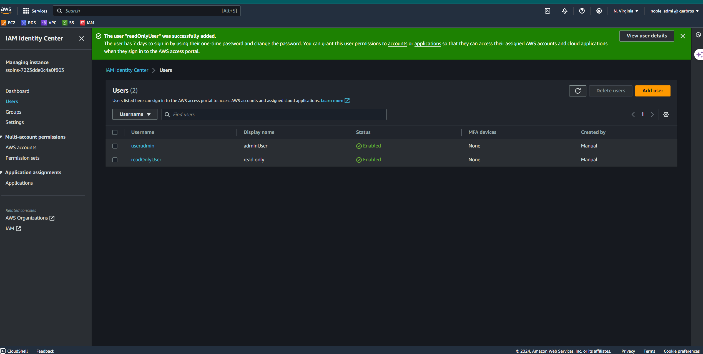
With these steps, I successfully created two new users and groups. These users are now set up to access multiple AWS accounts across AWS Organizations using IAM Identity Center.

> **Note:** IAM Identity Center also provides APIs for creating users and groups. For additional details, I would refer to the [Using IAM Identity Center Identity Store APIs](https://docs.aws.amazon.com/singlesignon/latest/userguide/identity-store-apis.html) section under the extra credit modules.
>
> ## Creating Permission Sets

Permission sets in IAM Identity Center provide a centralized way to define permissions, which are then applied to AWS accounts as IAM roles. In this part of the setup, I created two permission sets to manage access control efficiently: `AdministratorAccess` and `readOnly`.

#### Steps to Create Permission Sets

1. **Creating the `AdministratorAccess` Permission Set**

   - I clicked on **Permission sets** in the left menu under **Multi-account permissions**.
   - I then clicked the **Create permission set** button.

     On the **Select permission set type** page:

     - I chose **Predefined permission set** under Permission set type.
     - I selected the AWS managed policy **AdministratorAccess** from the Policy for predefined permission set dropdown.
     - I clicked **Next**.

     On the **Specify permission set details** page:

     - I kept all default settings and provided the necessary permission set details.
     - I clicked **Next**.

     On the **Review and create** page:

     - I reviewed my selections to ensure they were correct.
     - I clicked **Create**.

   Once created, I saw a confirmation page indicating that the `AdministratorAccess` permission set was successfully created.

3. **Creating the `readOnly` Permission Set**

   I repeated a similar process to create the `readOnly` permission set:

   - I went back to **Permission sets** and clicked **Create permission set**.

     On the **Select permission set type** page:

     - I chose **Predefined permission set** under Permission set type.
     - I selected the AWS managed policy **ViewOnlyAccess** from the Policy for predefined permission set dropdown.
     - I clicked **Next**.

     On the **Specify permission set details** page:

     - I entered `readOnly` as the Permission set name.
     - I left the remaining fields such as Description, Session Duration, Relay state, and Tags at their default values.
     - I clicked **Next**.

     On the **Review and create** page:

     - I reviewed my selections to confirm they were correct.
     - I clicked **Create**.

   After completing these steps, I successfully created two new permission sets: `AdministratorAccess` and `readOnly`. With these permission sets in place, I am now ready to move on to the provisioning step, where these sets will be assigned to users and groups.
   
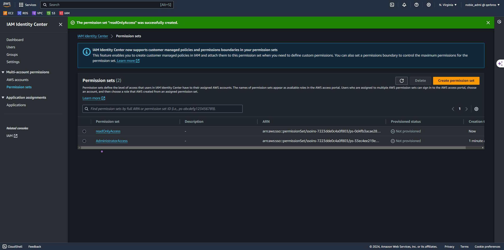

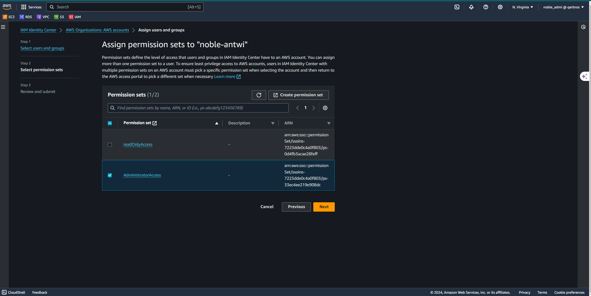
> **Note:** Properly managing permission sets is crucial for maintaining security and compliance in your AWS environment. These permission sets ensure that users have appropriate access levels based on their roles and responsibilities.

## Provisioning Permission Sets

When creating permission sets in IAM Identity Center, the next crucial step is provisioning them. By default, a newly created permission set isn't automatically applied to any AWS accounts. To make use of these permission sets, you need to assign them to users and groups in the desired AWS accounts.

### Steps to Provision Permission Sets

1. **Navigate to IAM Identity Center Console**

   I began by accessing the IAM Identity Center Console and selecting **AWS accounts**. I then chose the account where I wanted the users to have access.

   - I clicked **Assign users or groups** to start the provisioning process.

2. **Assign the `AdministratorAccess` Permission Set**

   - In the **Select users and groups** page, I chose **Groups**, selected `Administrators`, and clicked **Next**.

   - On the **Select permission sets** page:

     - I selected the `AdministratorAccess` permission set from the list.
     - I clicked **Next**.

   - On the **Review and submit** page:

     - I reviewed the information to ensure accuracy.
     - I clicked **Submit**.

   After submitting, IAM Identity Center associated the `Administrators` group with the `AdministratorAccess` permission set and applied it to the chosen AWS account. A confirmation page with a green banner appeared, indicating that the permission set was successfully provisioned.

3. **Provision the `readOnly` Permission Set**

   I repeated the process to provision the `readOnly` permission set:

   - In the IAM Identity Center Console, I chose **AWS accounts** and selected the same account used previously. I clicked **Assign users or groups**.

   - In the **Select users and groups** page, I selected **Groups**, chose `readOnly`, and clicked **Next**.

   - On the **Select permission sets** page:

     - I selected the `readOnly` permission set.
     - I clicked **Next**.

   - On the **Review and submit** page:

     - I reviewed the information to confirm it was correct.
     - I clicked **Submit**.

   The process was completed, and IAM Identity Center provisioned the `readOnly` permission set to the selected AWS account. A confirmation page with a green banner confirmed that the permission set was successfully applied.
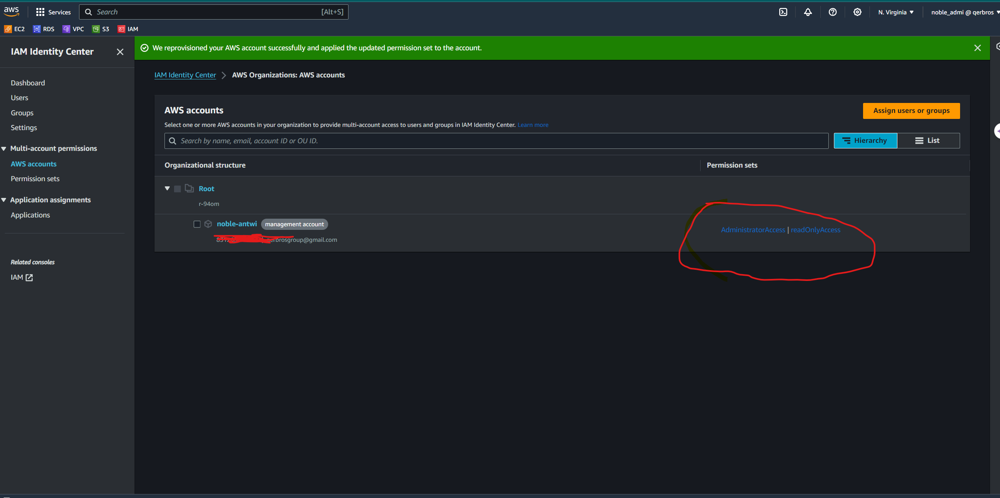

> **Note:** Properly provisioning permission sets is essential for ensuring that users and groups have the appropriate access levels in your AWS accounts. This step finalizes the configuration, enabling users to access resources according to their assigned roles.

With the permission sets now provisioned, I am ready to move on to testing the setup to ensure everything is functioning as expected.

## Testing the Access Based on User, Group, and Permission Set Assignments

To ensure our IAM Identity Center setup is working as intended, we'll validate the configurations by deploying an AWS CloudFormation stack. This stack will deploy various AWS resources to verify that user and group permissions are correctly assigned and functioning across accounts.

#### Steps to Deploy the CloudFormation Template

1. **Download the CloudFormation Template**

   - First, I downloaded the CloudFormation template needed for this setup from the provided link. 

2. **Navigate to the CloudFormation Console**

   - I accessed the AWS CloudFormation console from the AWS Management Console.

3. **Create a New Stack**

   - In the CloudFormation console, I clicked **Create stack** and selected **With new resources (standard)** to start creating the stack with the resources defined in the template.

4. **Prepare the Template**

   - On the **Create stack** page, I chose **Template is ready** for **Prepare template**.
   - I selected **Upload a template file** for **Template source**.
   - I clicked **Choose file** and uploaded the CloudFormation template file I downloaded earlier.

5. **Specify Stack Details**

   - On the **Specify stack details** page, I named the stack something descriptive like `iam-identitycenter-validation-setup` to easily identify it later.
   - I left the **Parameter LatestAmiId** value at its default setting, which was provided in the template.
   - I clicked **Next** to proceed with the stack creation.
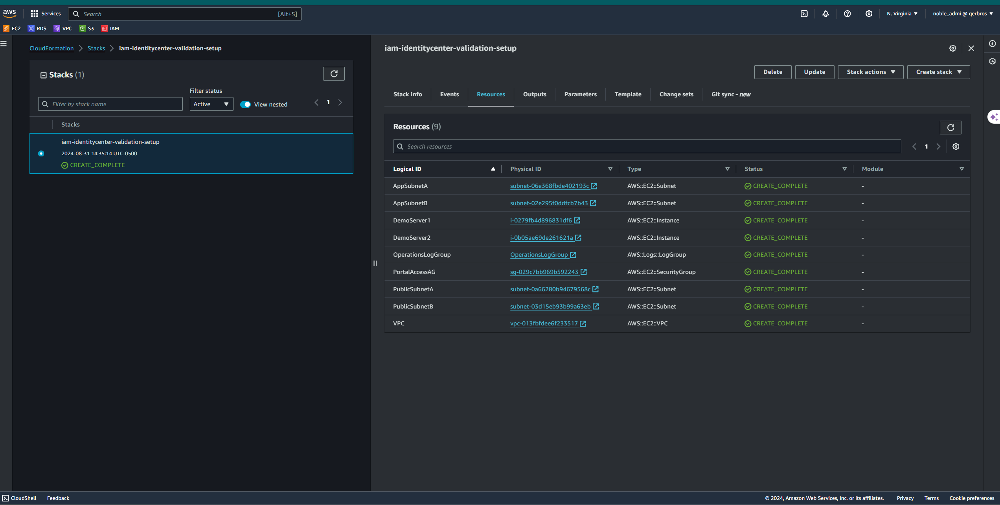

By following these steps, I set up a [CloudFormation](files/iam-identitycenter-validation.yml) stack that deploys essential AWS resources such as VPCs, subnets, EC2 instances, and VPC Security Groups. This deployment will help validate whether the IAM Identity Center configuration correctly manages user and group permissions as intended.

## Validating My IAM Identity Center Setup

Now that I’ve set up everything in IAM Identity Center and assigned those permission sets, it’s time to put my work to the test. I’m going to validate how both the `adminUser` and `readOnlyUser` interact with the AWS environment I’ve configured.

## Steps to Validate Access

### 1. Logging In as `adminUser`

- **Access the AWS Portal:**
  - I’ll start by logging into the AWS Access Portal using the URL I saved earlier when creating `adminUser`.
  - I’ll enter the username and the one-time password. This is the first step to ensuring my admin access is functioning correctly.
  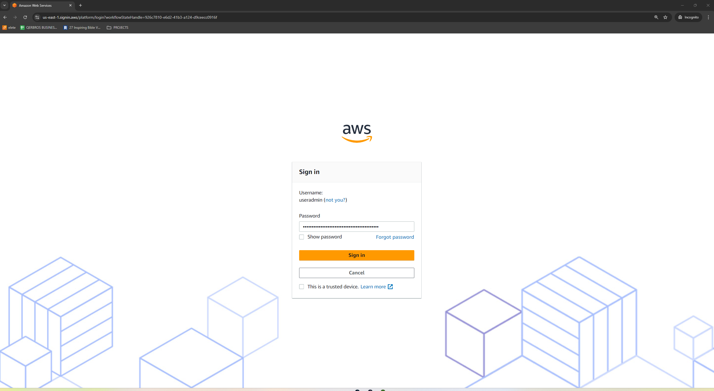

- **Setting a New Password:**
  - After logging in with the one-time password, I’ll set up a new password. Now I’m all set with my credentials!
  - 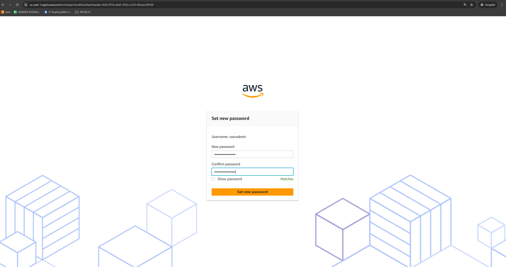
  
  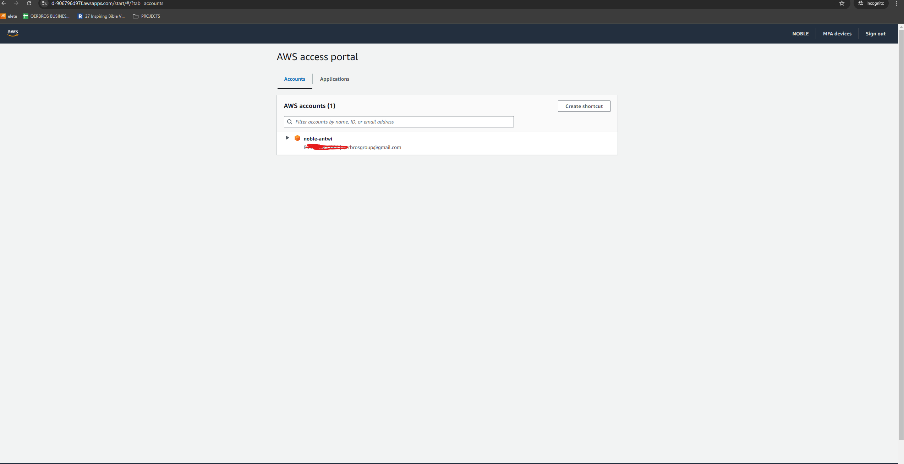

- **Accessing the AWS Management Console:**
  - On the AWS Portal page, I’ll click the **Management console** link associated with the `AdministratorAccess` role. This is where I’ll have full control over my AWS resources.
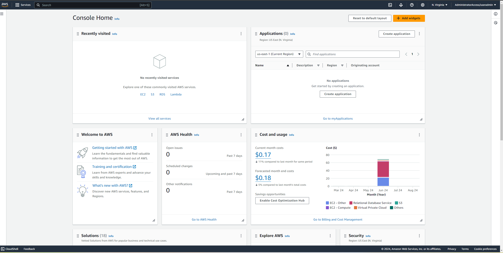

- **Stopping an EC2 Instance:**
- 
  - I’ll navigate to the EC2 console and select a running instance.
  - From the **Instance state** dropdown, I’ll choose **Stop instance**.
  - I should see a green banner confirming the instance was successfully stopped. This will confirm that my `adminUser` has the expected admin privileges.
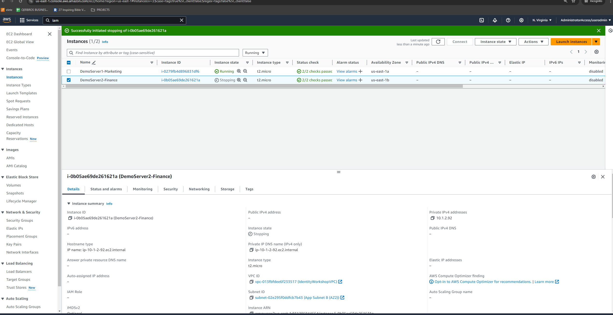
- **Signing Out:**
  - After validating that everything works as expected, I’ll sign out from both the AWS Management Console and the AWS Portal. That’s one user tested, and now onto the next.

### 2. Logging In as `readOnlyUser`

- **Accessing the AWS Portal Again:**
  - Now, I’ll log in using the `readOnlyUser` credentials with the one-time password.

- **Setting a New Password:**
  - Just like before, I’ll set a new password after logging in, ensuring `readOnlyUser` is ready to go.

- **Navigating the AWS Management Console:**
  - On the AWS Portal page, I’ll click the **Management console** link associated with the `readOnly` role. This time, I’m expecting limited access.

- **Attempting to Stop an EC2 Instance:**
  - I’ll head over to the EC2 console again, select a running instance, and try to stop it.
  - This time, I should see a red banner indicating that the operation failed. This confirms that `readOnlyUser` doesn’t have permission to stop instances, just as I intended.
  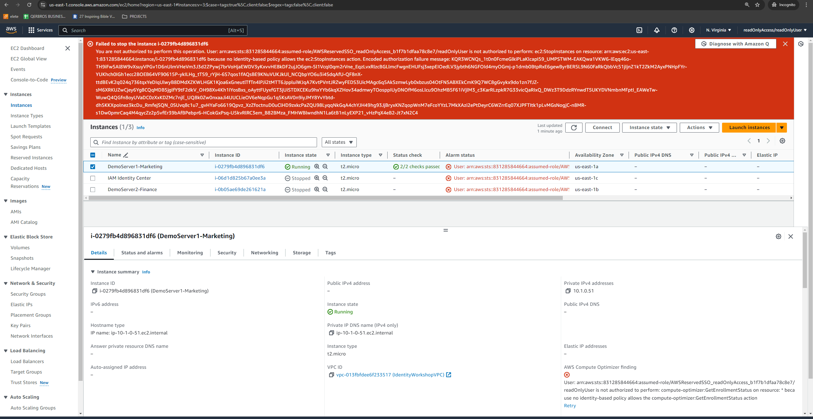
  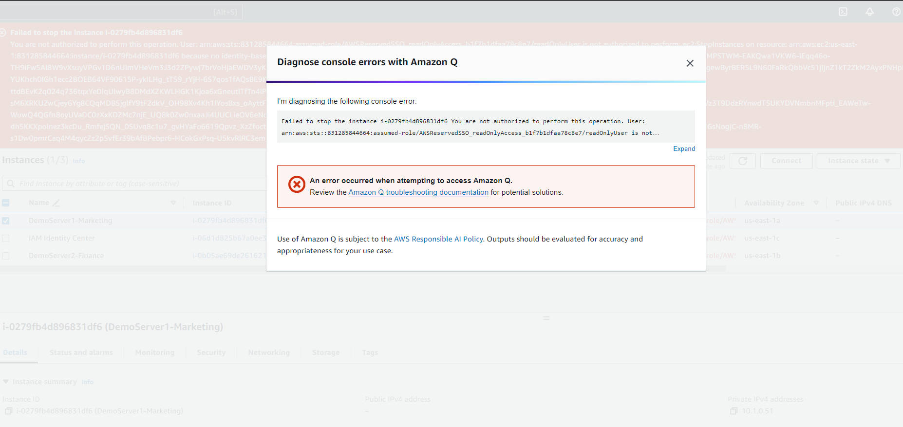

## Conclusion

With this test, I’ve confirmed that:
- My `adminUser` has full administrative control, able to manage EC2 instances without any issues.
- My `readOnlyUser` is appropriately restricted, preventing any actions beyond viewing.

This successful validation shows that my IAM Identity Center setup is working perfectly, with the right permissions in place for each user. I'm confident that I’ve set up a secure and well-managed environment in AWS.

## AWS CLI Access with IAM Identity Center

When working with AWS, I always lean on the AWS CLI to manage services programmatically. By tying it together with IAM Identity Center, I can switch between different AWS accounts and roles without the constant hassle of managing credentials.
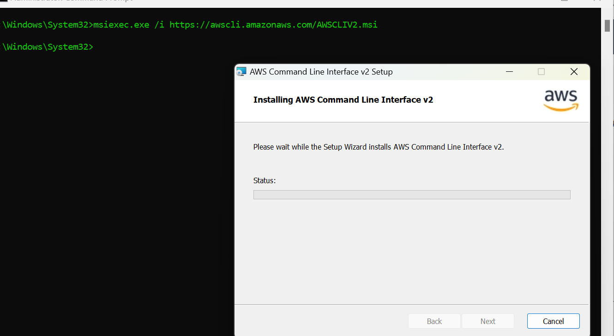

### Manual Credential Refresh
Initially, I tried the manual method for refreshing credentials. It’s pretty straightforward—log into the AWS access portal, grab the temporary credentials, and then use them. But honestly, having to copy and paste commands each time gets old quickly, especially if you’re juggling multiple tasks.

### Automatic Credential Refresh (Highly Recommended)
To save time and reduce friction, I moved to automatic credential refresh. It’s a smoother process where I use the `aws configure sso` command to set up profiles that take care of the credentials for me. This setup allows me to access any role associated with any permission set across all my AWS accounts, automatically.

### Configuring AWS CLI Profiles
I set up two profiles: `adminUser` and `readOnlyUser`.

#### AdminUser Profile
1. Ran the command: `aws configure sso --profile adminUser`.
   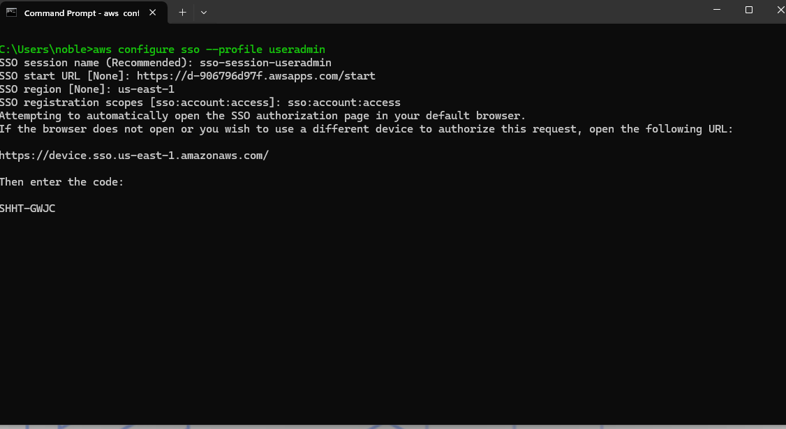
2. Set up a session name, provided the AWS start URL, and chose my preferred region.
3. Finalized the setup through the browser.
 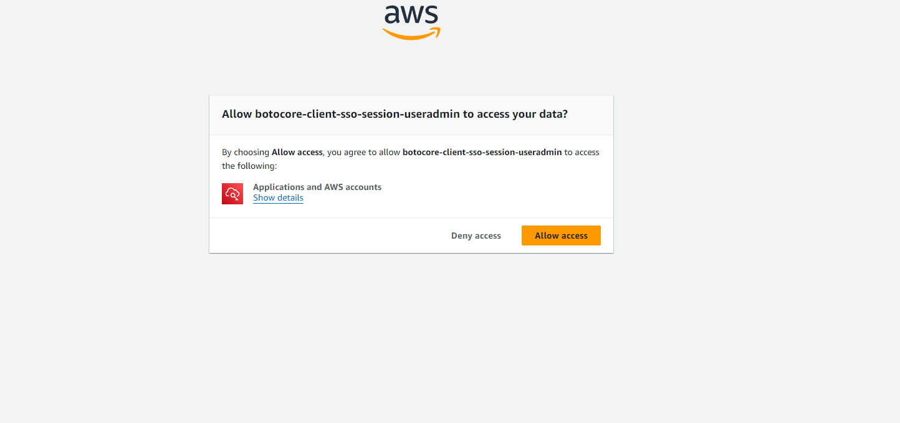

I tested this by running `aws s3 ls --profile adminUser`, and it worked like a charm. I even used the CLI to stop an EC2 instance, which confirmed everything was set up perfectly.
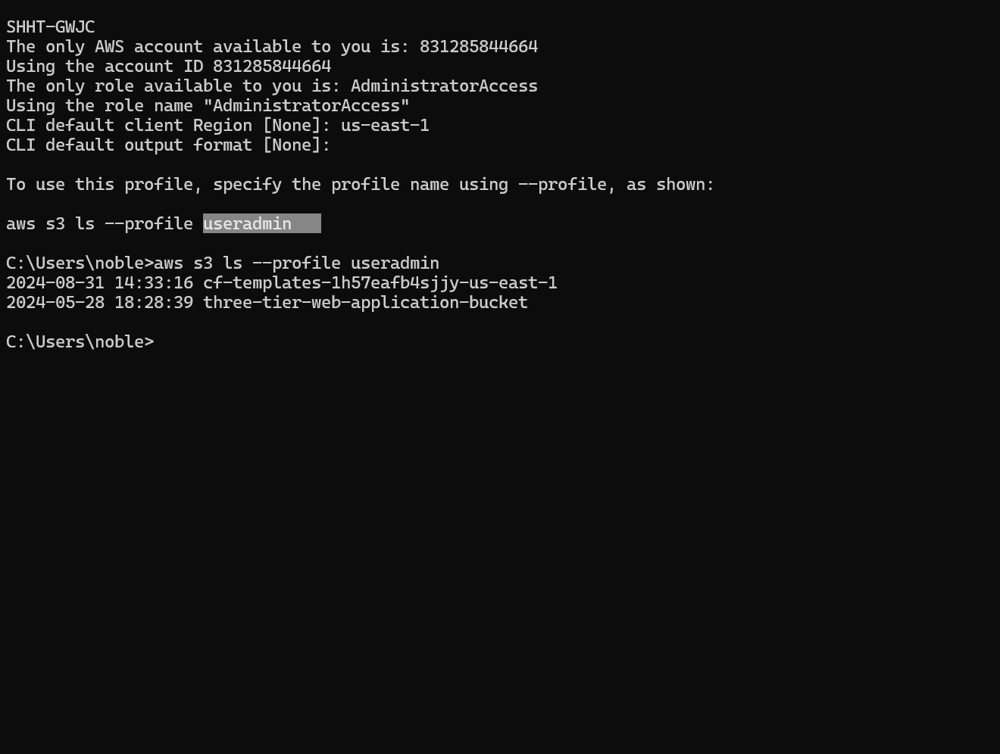

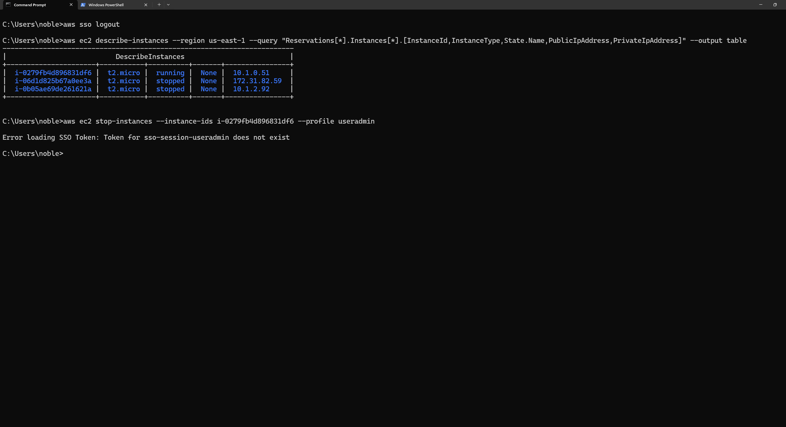

#### ReadOnlyUser Profile
For `readOnlyUser`, the setup was nearly identical. I expected limited access, and as expected, trying to stop an EC2 instance failed due to permissions, which is exactly what I wanted. It’s a great way to ensure the roles are properly enforced.

### Wrapping It Up
Integrating IAM Identity Center with the AWS CLI has made my workflow so much more efficient. I no longer have to manually manage credentials or switch profiles by hand—it’s all automated. And when I’m done, a simple `aws sso logout` ensures that all cached credentials are wiped, keeping everything secure. This setup has been a game-changer for managing multiple AWS environments without the usual headaches.

## Future Exploration Topics

As I continue to dive deeper into AWS security and identity management, there are several advanced methods I plan to explore further:

- **Time-Based Access Control**: I'll be looking into how to implement access control mechanisms that are time-sensitive, ensuring that access is only granted within specific time frames.

- **Customer Managed Policies**: Understanding how to create and manage my own IAM policies will be key to customizing security according to specific requirements.

- **Attribute-Based Access Control (ABAC)**: This method is intriguing as it allows for more dynamic access control based on user attributes. I’m curious to see how this can simplify permissions management.

- **Using IAM Identity Center Identity Store APIs**: Exploring these APIs will help me automate and customize identity management even further.

- **Using External IDPs with Identity Center**:
  - **Okta**: I'm particularly interested in how Okta integrates with AWS Identity Center, given its widespread use.
  - **Azure AD**: Since Azure AD is commonly used in enterprise environments, understanding this integration will be crucial for multi-cloud strategies.
  - **Ping Federate**: I’ll be exploring how Ping Federate can be leveraged for federated identity management within AWS.

These topics are on my radar, and I’ll be diving into each of them as I progress in my journey.

For those interested in following along or diving into the details themselves, the project link is available here: [AWS Workshop Project](https://catalog.us-east-1.prod.workshops.aws/workshops/590f8439-42c7-46a1-8e70-28ee41498b3a/en-US).

## Summary

In this workshop, I explored how to manage workforce identity at scale using IAM Identity Center. Here are the key takeaways:

- **Centralized Identity Management**: IAM Identity Center allows you to create or connect your workforce identities in AWS once and manage secure access centrally across AWS. This centralization streamlines identity management and enhances security.

- **Flexibility with Identity Sources**: I can choose my preferred identity source for use across AWS, giving me the freedom to integrate with various identity providers that best fit my organization’s needs.

- **Multi-Account Permissions**: The ability to manage fine-grained permissions at scale is a major benefit. IAM Identity Center simplifies the management of permissions across multiple AWS accounts, making it easier to control access and enforce security policies.

- **Application Assignments**: IAM Identity Center provides a single place to manage access to AWS and other cloud applications. This unified approach to application assignments simplifies administration and ensures consistent access control across the board.

This workshop has been instrumental in understanding how IAM Identity Center can streamline identity management and enhance security across AWS environments.
## Workshop Contributors

I want to extend a heartfelt thank you to the incredible team behind this workshop:

- **Peter Buonora**, Principal Solutions Architect, AWS
- **Siva Rajamani**, Principal Solutions Architect, AWS
- **Sasi Jayalekshmi**, Principal Solutions Architect, AWS
- **Tim Holm**, Principal Solutions Architect, AWS
- **Bala KP**, Senior Partner Solutions Architect, AWS
- **Arun Sivaraman**, Solutions Architect, AWS

Your expertise and dedication in creating and delivering this workshop have been invaluable. Your hard work has made it possible for us to manage workforce identity at scale using IAM Identity Center, and I deeply appreciate the effort and insights you've shared.
